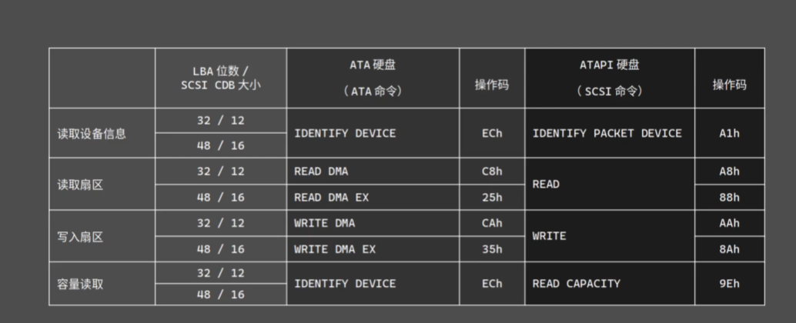

https://zhuanlan.zhihu.com/p/486729471

## 如何读写磁盘？

1. PIO
    - CPU下达指令
    - 磁盘相应指令，通过CPU向内存读取或写入数据
2. DMA
    - CPU下达指令
    - 磁盘相应指令，根据实现和CPU约定好的地址，通过DMA控制器，直接向内存读取或写入数据

## 如何写AHCI驱动

1. 通过PCI总线访问AHCI(HBA)，AHCI负责和SATA控制器进行交互
2. AHCI基于报文交换。Frame Information Structure, FIS。
3. SATA控制器将物理扇区映射到逻辑扇区，软件可以通过逻辑扇区的编号访问扇区。
4. DMA读扇区
    - 主机通过寄存器FIS写入命令和要读取的扇区和数据大小
    - 设备通过DMA配置FIS取配置主机的DMA控制器
    - 主机ACK
    - 设备通过DMA向主机发送数据FIS，完成CRC校验并且放入内存
    - 设备写入内存完成后发送寄存器FIS，报告当前状态和发生的错误
5. DMA写扇区
    - 主机通过寄存器FIS写入命令和写入的LBA
    - 设备ACK
    - 主机配置设备的DMA
    - 设备发送DMA激活FIS，通知主机可以开始数据传输
    - 主机向设备传输数据
    - 完成后设备发送寄存器FIS，报告当前状态和发生的错误
6. 一个AHCI芯片至少可以带32个SATA控制器
7. 从BAR#6的地址(物理基地址)读出AHCI和全局寄存器和寄存器组。每个寄存器32位
8. 操作系统需要为AHCI芯片分配空间。每个port需要PxCLB和PxFB。

9. AHCI初始化
    1. GHC寄存器AE置位，表示使用AHCI模式
    2. 读取PI寄存器，找出所有已经开启的端口
    3. 读取CAP寄存器的NCS字段，找出每个端口命令队列可用长度
    4. 对于每一个端口：
        1. 进行端口重置
        2. 分配操作空间，设置PxCLB和PxFB
        3. 将PxSERR寄存器清空
        4. 将需要使用的中断通过PxIE寄存器开启
    5. 最后将GHC的IE位置位，使得HBA可以向CPU发送中断
10. 所以首先通过PCI驱动找到AHCI设备
11. 初始化AHCI
    - 初始化ACHI中断
    - 读取AHCI全局寄存器，包括获取主板上的SATA口数量，总共有多少已经接入了硬盘。哪些已经接入了硬盘
    - 重置端口寄存器组
    - 为PxCLB和PxFB分配对齐的命令和FIS内存
    - 设置寄存器组就绪，设置中断
    - 重置端口
12. 向设备发送一个命令
    - 在命令队列中找到一个空闲的位置(扫描CI寄存器)
    - 构建命令头，根据需求设置好字段
    - 分配*连续的物理空间*作为命令表 
    - 根据需求设定好命令表(设置FIS,设置PRDT)
    - 将命令表的物理地址挂载到命令头上
    - 将PxCI对应位置位
    - 等待直到PxCI对应位清零，表示命令执行完成
    - 读取PxTFD寄存器，获取执行结果和错误代码

13. 使用IDENTIFY DEVICE 或者 IDENTIFY PACKET DEVICE命令探测磁盘信息
14. 可以探测PxSIG寄存器判断时ATA设备还是ATAPI设备
15. 不同设备的识别和读写是使用不同的命令的，也就是需要不同的实现
16. 每个命令需要三个参数，设置好FIS的字段
    - 起始LBA地址
    - 需要读入的逻辑块数量
    - 数据的存储位置，需要物理上连续，挂在PRDT里

 
## SCSI

1. FIS --> CDB
2. FIS小端序-->CDB大端序
