## call number 

The system call number of XV6 is different from the required one (a small pitfall), just change it to the required one  
(call write before calling sys_times here)
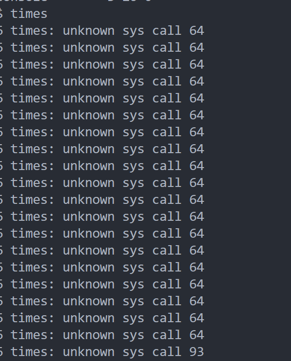

## sleep syscall
The test file seems to use ``timeval`` instead of ``timespec``
 


## other 
1. be careful about duplicate file names when ``mkfs``, may lead to unknown error


## debug 记录

### thread.1

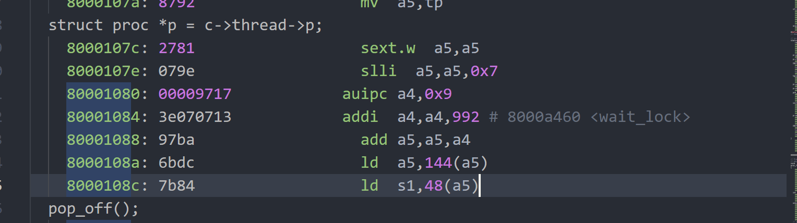


p->thread == null!!


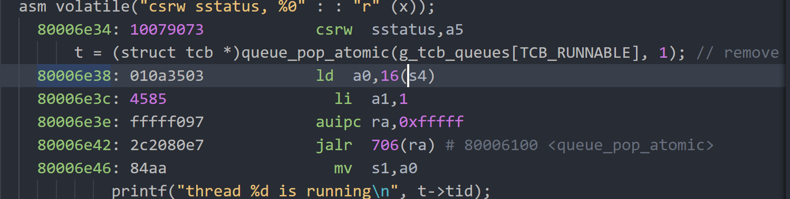


scheduler刚开中断，c-> = 0时直接进kerneltrap,导致myproc()空指针引用
是时钟中断！


调用``myproc()``必须保证c->t != null!!
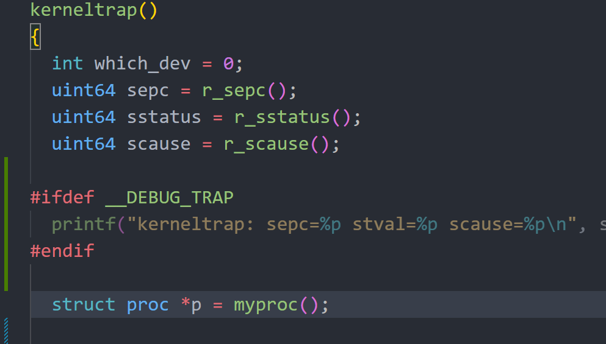

改为
``` c
  if(which_dev == 2 && mythread() != 0 && mythread()->state == TCB_RUNNING) {
    myproc()->ktime++;  
    thread_yield();
  }

```

### thread.2


q == null!

原因是没有`tcb_running queue`，但是使用了`tcb_q_change_state()`
因为每一个running线程一定由CPU保存，所以不需要一个额外队列保存

### thread.3

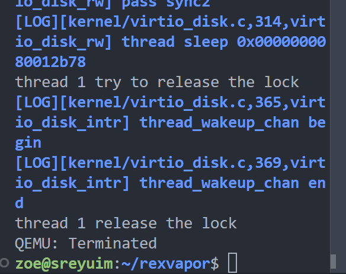
lost wakeup

push sleeping queue没问题，问题应该出在遍历queue
原来是调用处写错了member name


### thread.4

`usertrapret()`之后卡住

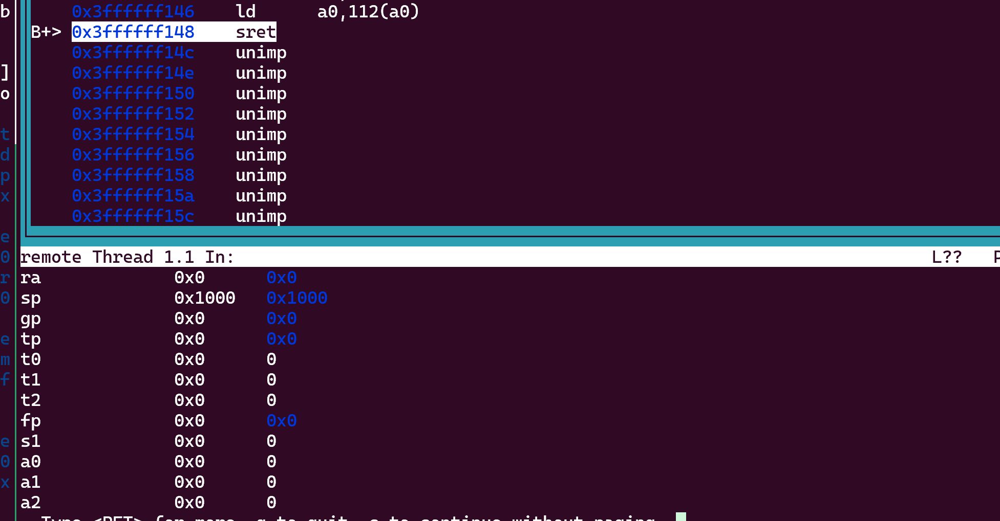
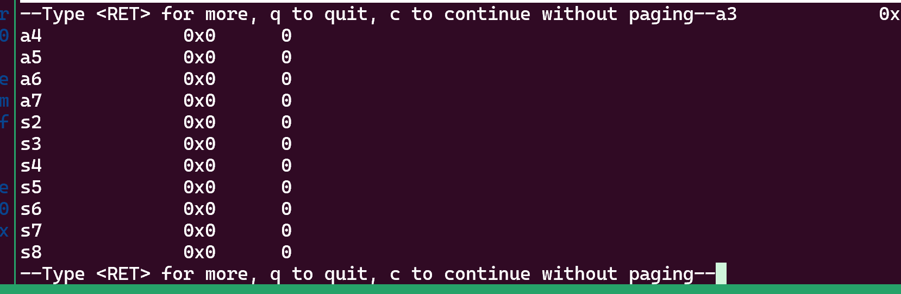
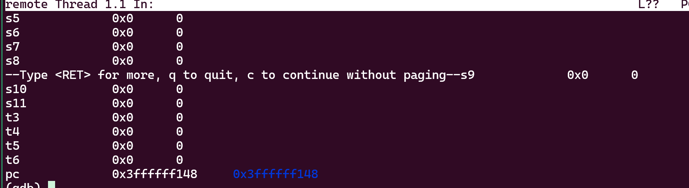
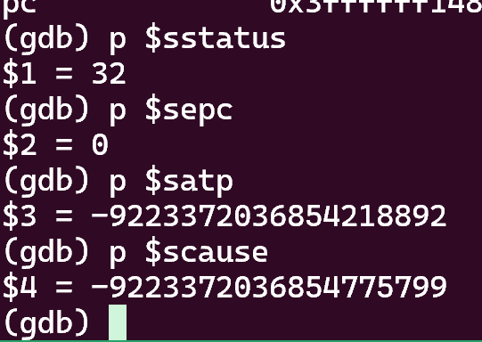
0x0处的代码：
  
用户页表 :
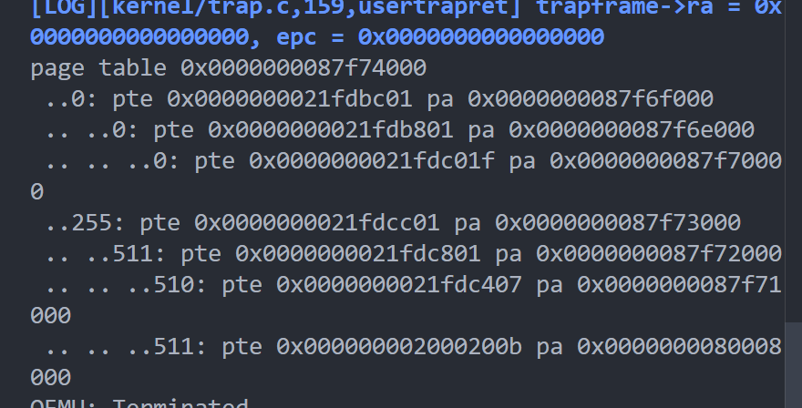


！！！ 问题在于sret之后不知道发生了什么。但是用户触发了一个外部中断进入到uservec中，随后在uservec对栈进行了写入操作。不知为何发生了,继续进入uservec，随后死循环

uservec 暂时先不写栈呢
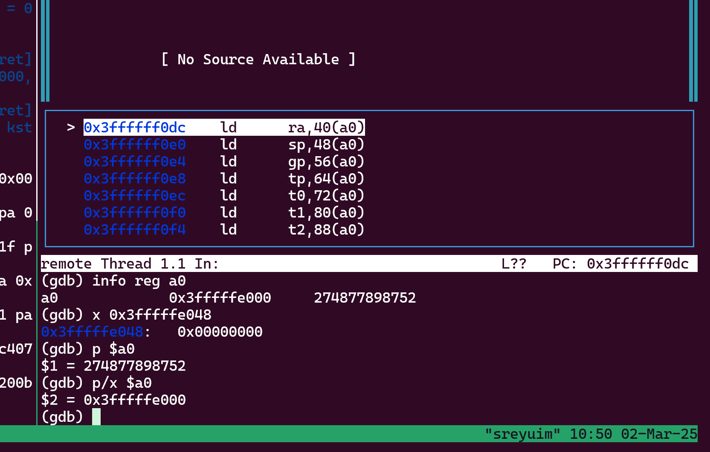


xv6的:
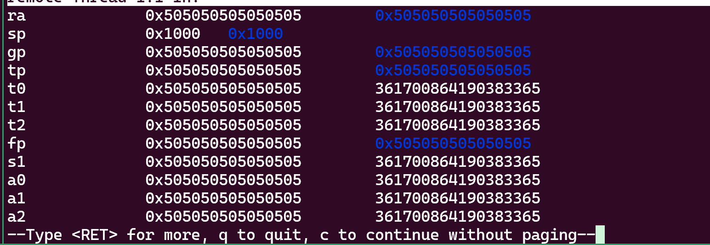


用户页表：
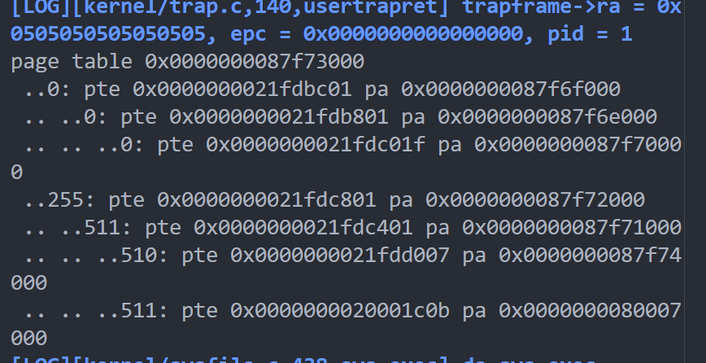

### thread.5

do_exec无法成功返回用户态

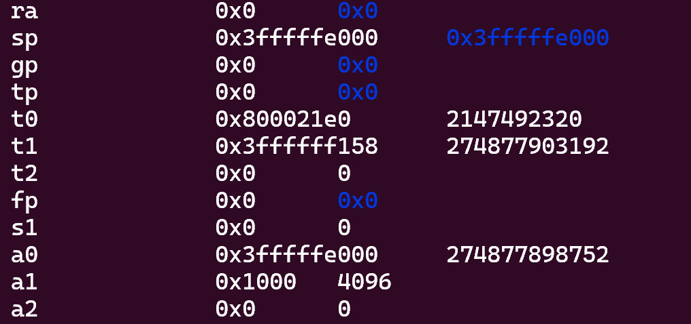

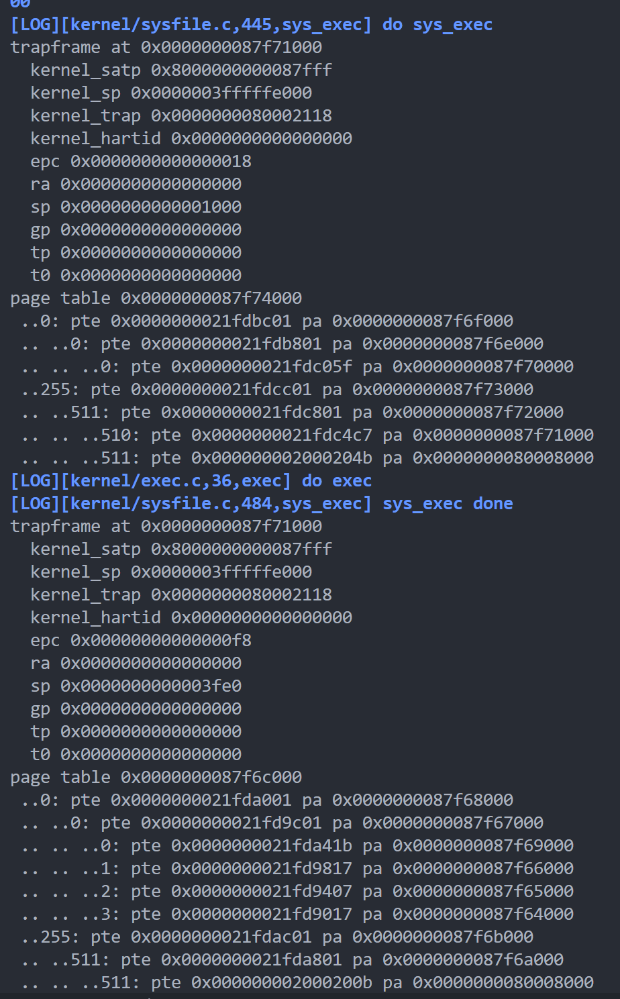
trapframe未映射,重新分配即可
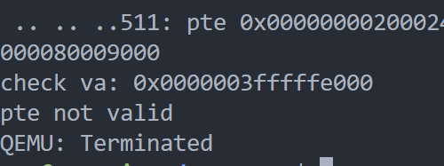

```
[LOG][kernel/sysfile.c,447,sys_exec] do sys_exec
trapframe at 0x0000000087f31000
  kernel_satp 0x8000000000087fff
  kernel_sp 0x0000003fffffe000
  kernel_trap 0x00000000800022de
  kernel_hartid 0x0000000000000000
  epc 0x0000000000000018
  ra 0x0000000000000000
  sp 0x0000000000001000
  gp 0x0000000000000000
  tp 0x0000000000000000
  t0 0x0000000000000000
page table 0x0000000087f34000
 ..0: pte 0x0000000021fcbc01 pa 0x0000000087f2f000
 .. ..0: pte 0x0000000021fcb801 pa 0x0000000087f2e000
 .. .. ..0: pte 0x0000000021fcc05f pa 0x0000000087f30000
 ..255: pte 0x0000000021fccc01 pa 0x0000000087f33000
 .. ..511: pte 0x0000000021fcc801 pa 0x0000000087f32000
 .. .. ..510: pte 0x0000000021fcc4c7 pa 0x0000000087f31000
 .. .. ..511: pte 0x000000002000244b pa 0x0000000080009000
check va: 0x0000003fffffe000
pte 0x0000000021fcc4c7
pa 0x0000000087f31000
unknow devintr()
scause 0x000000000000000d
sepc=0x000000008000828e stval=0x0000000000000000
panic: kerneltrap
QEMU: Terminated
```
### thread.6

`exec()`尝试返回用户态时无限重入`usertrapret()`

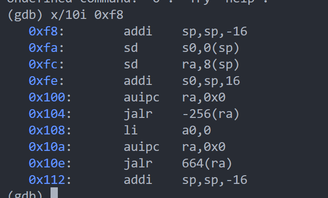
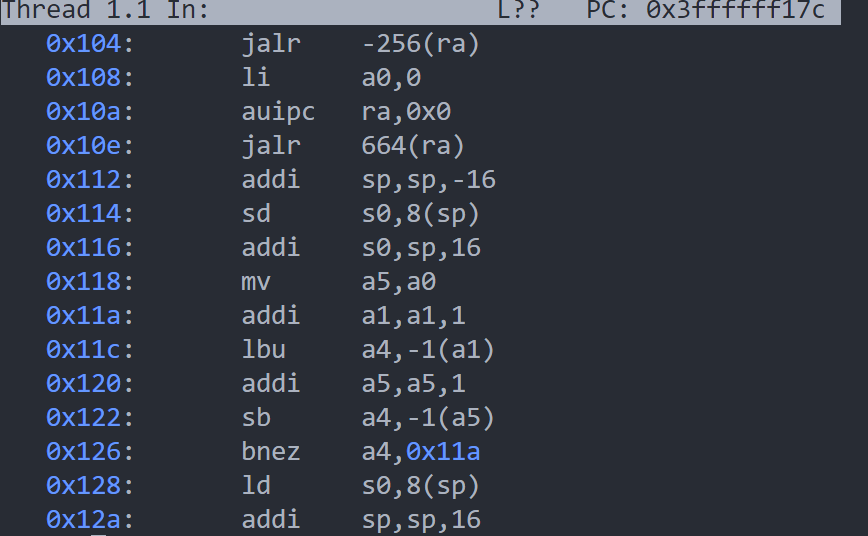

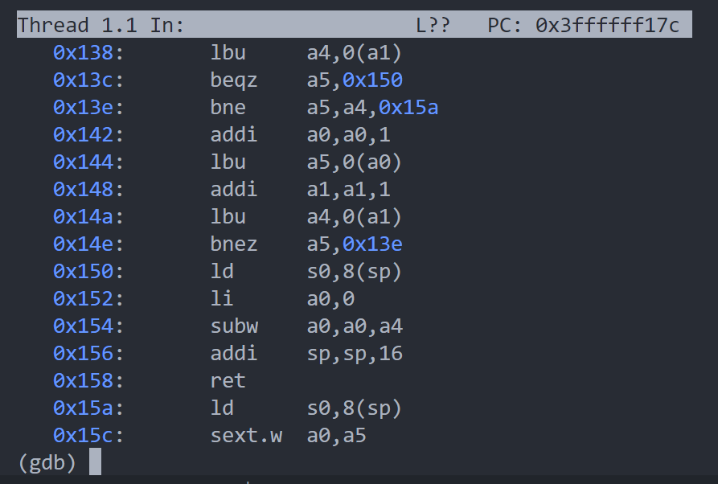
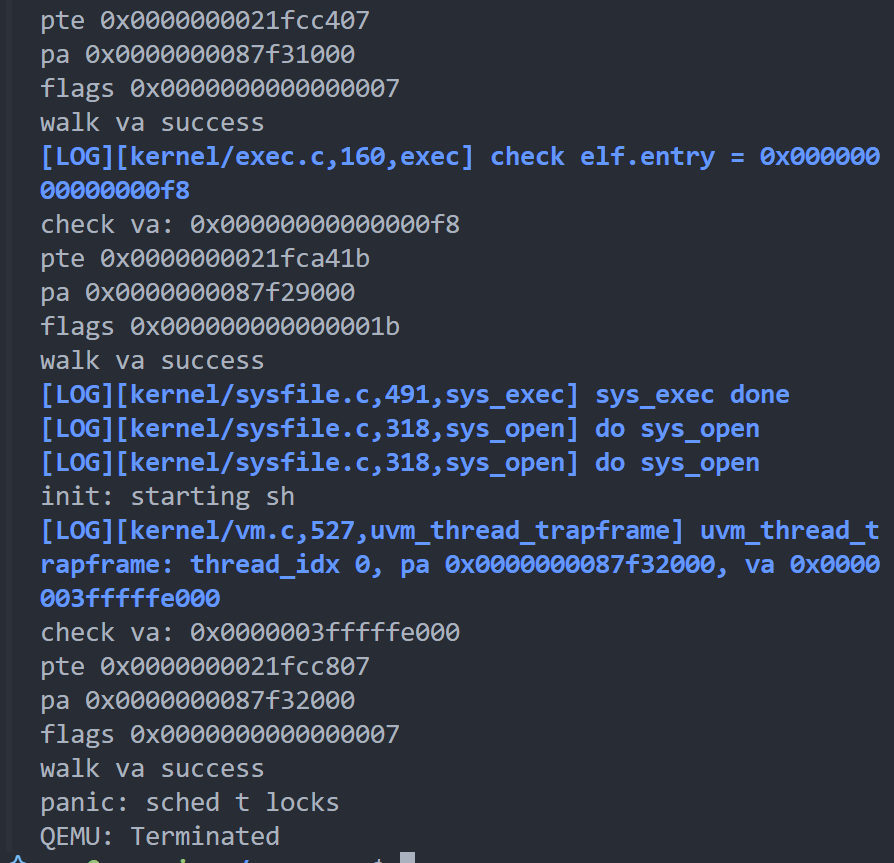

暂不确定哪里出现了问题，似乎是调试条件打错了导致一直输出调试信息。但是为何一直重入，应该是某个syscall出问题了。

### thread.7

`fork`之后panic

panic:

``` c
    if(mycpu()->noff != 1)
    panic("sched t locks");
```
`fork()` 中未将group leader thread lock 释放

### thread.8

```
init fork finished!
[LOG][kernel/sched.c,96,thread_sched] thread 1 is in thread_sched
panic: usertrap: not from user mode
QEMU: Terminated

```

`usertrapret()` 
- $sepc == 0x3d8  ret
- $ra == 0x64
- first pgfault in uservec: $sp = 0x3eb0
- can store: $sp = 0x2fe0

```
thread 2 is ready to run
try to get thread2's lock
get the lock of thread 2
ready to switch to thread 2
thread 2 ready to userret
thread 2 usertrap!

process 2, thread 2
sstatus : 0x100
scause: 0xf
panic: usertrap: not from user mode
```

这个bug和thread.4一样，都是无法写栈导致的问题。问题在于我已经检查了物理内存分配且被映射于用户页表中，权限也没问题。  

现在的解决方案： 暂时不用栈来做计算，而是调用`usertrapret()`时将当前线程的trampframe虚拟地址传入函数，最终写入sscratch寄存器，`uservec()`时直接从sscratch中取即可

### thread.9

[LOG][kernel/virtio_disk.c,228,virtio_disk_rw] into disk_rw!
[LOG][kernel/virtio_disk.c,232,virtio_disk_rw] thread 19 try to acquire disk.vdisk_lock
[LOG][kernel/virtio_disk.c,236,virtio_disk_rw] thread 19 has acquired disk.vdisk_lock
[LOG][kernel/virtio_disk.c,247,virtio_disk_rw] alloc_desc break
[LOG][kernel/virtio_disk.c,296,virtio_disk_rw] reach sync1
[LOG][kernel/virtio_disk.c,300,virtio_disk_rw] pass sync1
[LOG][kernel/virtio_disk.c,311,virtio_disk_rw] pass sync2
[LOG][kernel/virtio_disk.c,319,virtio_disk_rw] thread sleep 0x0000000080014230
panic: acquire

带着线程锁进入了`thread_sleep()`
解决方法: `thread_exit()`中不应带着线程锁进入`proc_exit()`.调整获取锁顺序


### thread.10
test copyin: [INFO] fork: parent 3, child 5, child->leader_thread id: 5
[LOG][kernel/thread.c,250,thread_exit] thread 5 exit

[LOG][kernel/thread.c,271,thread_exit] thread 5 has release p->lock

[LOG][kernel/thread.c,277,thread_exit] thread 5 has acquired p->tg.lock

[LOG][kernel/thread.c,285,thread_exit] thread 5 try to release p->tg.lock

[LOG][kernel/thread.c,291,thread_exit] thread 5 released p->tg.lock

panic: freewalk: leaf

[INFO] thread 3's trapframe in freewalk: 0x0000000087f33000
[INFO] panic pte 0x0000000020ab58c7
panic: freewalk: leaf

test copyinstr3:
page table 0x0000000087f20000
 ..0: pte 0x00000000209b5001 pa 0x00000000826d4000
 .. ..0: pte 0x0000000020934c01 pa 0x00000000824d3000
 ..255: pte 0x0000000021fcb401 pa 0x0000000087f2d000
 .. ..511: pte 0x0000000021fcd001 pa 0x0000000087f34000
 .. .. ..510: pte 0x00000000200b08c7 pa 0x00000000802c2000
[INFO] thread 3's trapframe in freewalk: 0x0000000087f33000
[INFO] panic pte 0x00000000200b08c7
panic: freewalk: leaf

test copyin:
page table 0x0000000087f20000
 ..0: pte 0x00000000200b0801 pa 0x00000000802c2000
 .. ..0: pte 0x0000000020130c01 pa 0x00000000804c3000
 ..255: pte 0x0000000021fcb401 pa 0x0000000087f2d000
 .. ..511: pte 0x0000000021fcd001 pa 0x0000000087f34000
 .. .. ..510: pte 0x0000000021fc14c7 pa 0x0000000087f05000
[INFO] thread 3's trapframe in freewalk: 0x0000000087f33000
[INFO] panic pte 0x0000000021fc14c7, pa 0x0000000087f05000
panic: freewalk: leaf
??? 偶发错误？


### thread.11
test killstatus: [INFO] fork: parent 3, child 30, child->leader_thread id: 30
[INFO] fork: parent 30, child 31, child->leader_thread id: 31
panic: acquire
