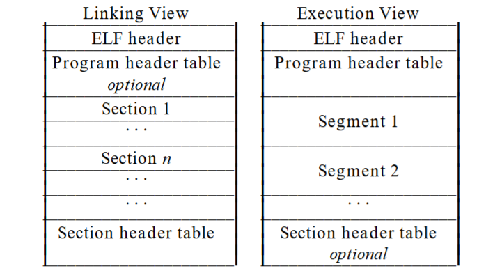
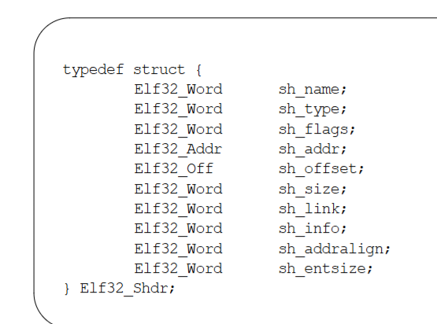
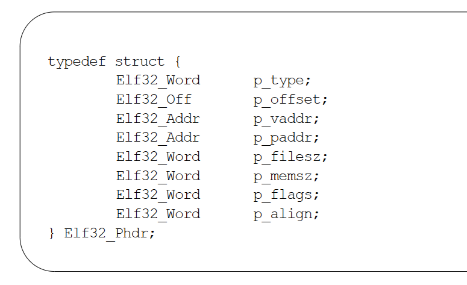
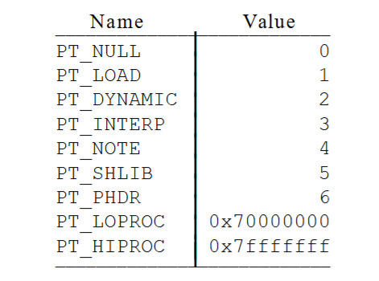

https://wiki.osdev.org/ELF  
https://refspecs.linuxfoundation.org/elf/elf.pdf#page=3.48  
http://www.skyfree.org/linux/references/ELF_Format.pdf

# ELF

The following is a rough outline of the steps that an ELF executable loader must perform:

- Verify that the file starts with the ELF magic number (4 bytes) as described in figure 1-4 (and subsequent table) on page 11 in the ELF specification.  
- Read the ELF Header. The ELF header is always located at the very beginning of an ELF file. The ELF header contains information about how the rest of the file is laid out. An executable loader is only concerned with the program headers.  
- Read the ELF executable's program headers. These specify where in the file the program segments are located, and where they need to be loaded into memory.  
- Parse the program headers to determine the number of program segments that must be loaded. Each program header has an associated type, as described in Figure 2-2 of the ELF specification. Only headers with a type of PT_LOAD describe a loadable segment.  
- Load each of the loadable segments. This is performed as follows:  
Allocate virtual memory for each segment, at the address specified by the p_vaddr member in the program header. The size of the segment in memory is specified by the p_memsz member.  
- Copy the segment data from the file offset specified by the p_offset member to the virtual memory address specified by the p_vaddr member. The size of the segment in the file is contained in the p_filesz member. This can be zero.  
- The p_memsz member specifies the size the segment occupies in memory. This can be zero. If the p_filesz and p_memsz members differ, this indicates that the segment is padded with zeros. All bytes in memory between the ending offset of the file size, and the segment's virtual memory size are to be cleared with zeros.  
- Read the executable's entry point from the ELF header.  
- Jump to the executable's entry point in the newly loaded memory.  

An **ELF header **resides at the beginning and holds a ‘‘road map’’ describing the file’s organization. **Sections** hold the bulk of object file information for the linking view: instructions, data, symbol table, relocation information, and so on.A **program header table**, if present, tells the system how to create a process image

## ELF - section header

## ELF - program header

### p_type

- `PT_LOAD` The array element specifies a loadable segment, `p_filesz` <= `p_memsz` , mem area = area of filesz + memsz - filesz '0' (hold .bss section)

- `PT_INTERP` specifies the location and size of a null-terminated path name to
invoke as an interpreter.

- `PT_PHDR` if present, specifies the location and size of the program header table
itself, both in the file and in the memory image of the program

### executable file and shared object 

One aspect of segment loading differs between `executable files and shared objects`. `Executable file` segments typically contain absolute code. To let the process execute correctly, the segments must reside at
the virtual addresses used to build the executable file. Thus the system uses the p_vaddr values
unchanged as virtual addresses.  
On the other hand, `shared object` segments typically contain position-independent code. This lets a
segment’s virtual address change from one process to another, without invalidating execution behavior.
Though the system chooses virtual addresses for individual processes, it maintains the segments’ relative
positions. Because position-independent code uses relative addressing between segments, the difference
between virtual addresses in memory must match the difference between virtual addresses in the file.
The following table shows possible shared object virtual address assignments for several processes, illustrating constant relative positioning. The table also illustrates the base address computations.

## Dynamic linking

### program interpreter
An executable file may have one `PT_INTERP` program header element. During exec(BA_OS), the system retrieves a path name from the `PT_INTERP` segment and creates the initial process image from the
interpreter file’s segments. That is, instead of using the original executable file’s segment images, the system composes a memory image for the interpreter.*It then is the interpreter’s responsibility to receive
control from the system and provide an environment for the application program.*  

When building an executable file that uses dynamic linking, the link editor adds a program header element of type PT_INTERP to an executable file, telling the system to invoke the dynamic linker as the program interpreter.

# libc_start_main

https://refspecs.linuxbase.org/LSB_3.1.0/LSB-generic/LSB-generic/baselib---libc-start-main-.html  
https://stackoverflow.com/questions/62709030/what-is-libc-start-main-and-start  
http://dbp-consulting.com/tutorials/debugging/linuxProgramStartup.html
