## xv6

xv6文件系统  
官方文档总结：

https://th0ar.gitbooks.io/xv6-chinese/content/content/chapter6.html   
https://www.cnblogs.com/KatyuMarisaBlog/p/14366115.html

The superblock is filled in by a separate program, called mkfs,
which builds an initial file system.

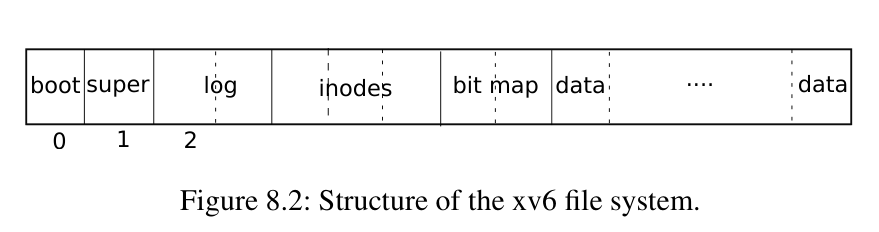

## ext4
All fields in ext4 are written to disk in little-endian order. HOWEVER, all fields in jbd2 (the journal) are written to disk in big-endian order.  

introduction:
https://www.youtube.com/watch?v=B6kg2zeJ9do

data structure :
https://docs.kernel.org/filesystems/ext4/

### block group 

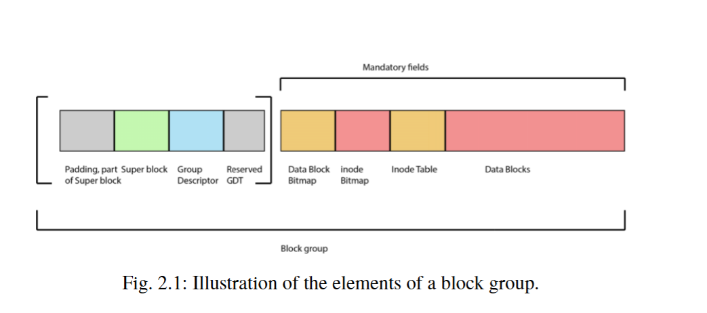

The first part of the block group is 1024 bytes reserved that can be
used for boot code and form part of the first superblock [10, p. 402]. It is not a
requirement that each block group has a superblock.Since the superblock describes the overall file system; any superblock can be used
to recover the file system.  


### super block

The superblock defines the features supported in three different 32 bit fields;   
Specifies how to mount a file system if unrecognized *feature* are encountered on the system

```c
/*
 * Structure of the super block
 */
struct ext4_super_block {
/*00*/	__le32	s_inodes_count;		/* Inodes count */
	__le32	s_blocks_count_lo;	/* Blocks count */
	__le32	s_r_blocks_count_lo;	/* Reserved blocks count */
	__le32	s_free_blocks_count_lo;	/* Free blocks count */
/*10*/	__le32	s_free_inodes_count;	/* Free inodes count */
	__le32	s_first_data_block;	/* First Data Block */
	__le32	s_log_block_size;	/* Block size */
	__le32	s_log_cluster_size;	/* Allocation cluster size */
/*20*/	__le32	s_blocks_per_group;	/* # Blocks per group */
	__le32	s_clusters_per_group;	/* # Clusters per group */
	__le32	s_inodes_per_group;	/* # Inodes per group */
	__le32	s_mtime;		/* Mount time */
/*30*/	__le32	s_wtime;		/* Write time */
	__le16	s_mnt_count;		/* Mount count */
	__le16	s_max_mnt_count;	/* Maximal mount count */
	__le16	s_magic;		/* Magic signature */
	__le16	s_state;		/* File system state */
	__le16	s_errors;		/* Behaviour when detecting errors */
	__le16	s_minor_rev_level;	/* minor revision level */
/*40*/	__le32	s_lastcheck;		/* time of last check */
	__le32	s_checkinterval;	/* max. time between checks */
	__le32	s_creator_os;		/* OS */
	__le32	s_rev_level;		/* Revision level */
/*50*/	__le16	s_def_resuid;		/* Default uid for reserved blocks */
	__le16	s_def_resgid;		/* Default gid for reserved blocks */
	/*
	 * These fields are for EXT4_DYNAMIC_REV superblocks only.
	 *
	 * Note: the difference between the compatible feature set and
	 * the incompatible feature set is that if there is a bit set
	 * in the incompatible feature set that the kernel doesn't
	 * know about, it should refuse to mount the filesystem.
	 *
	 * e2fsck's requirements are more strict; if it doesn't know
	 * about a feature in either the compatible or incompatible
	 * feature set, it must abort and not try to meddle with
	 * things it doesn't understand...
	 */
	__le32	s_first_ino;		/* First non-reserved inode */
	__le16  s_inode_size;		/* size of inode structure */
	__le16	s_block_group_nr;	/* block group # of this superblock */
	__le32	s_feature_compat;	/* compatible feature set */
/*60*/	__le32	s_feature_incompat;	/* incompatible feature set */
	__le32	s_feature_ro_compat;	/* readonly-compatible feature set */
/*68*/	__u8	s_uuid[16];		/* 128-bit uuid for volume */
/*78*/	char	s_volume_name[EXT4_LABEL_MAX];	/* volume name */
/*88*/	char	s_last_mounted[64] __nonstring;	/* directory where last mounted */
/*C8*/	__le32	s_algorithm_usage_bitmap; /* For compression */
	/*
	 * Performance hints.  Directory preallocation should only
	 * happen if the EXT4_FEATURE_COMPAT_DIR_PREALLOC flag is on.
	 */
	__u8	s_prealloc_blocks;	/* Nr of blocks to try to preallocate*/
	__u8	s_prealloc_dir_blocks;	/* Nr to preallocate for dirs */
	__le16	s_reserved_gdt_blocks;	/* Per group desc for online growth */
	/*
	 * Journaling support valid if EXT4_FEATURE_COMPAT_HAS_JOURNAL set.
	 */
/*D0*/	__u8	s_journal_uuid[16];	/* uuid of journal superblock */
/*E0*/	__le32	s_journal_inum;		/* inode number of journal file */
	__le32	s_journal_dev;		/* device number of journal file */
	__le32	s_last_orphan;		/* start of list of inodes to delete */
	__le32	s_hash_seed[4];		/* HTREE hash seed */
	__u8	s_def_hash_version;	/* Default hash version to use */
	__u8	s_jnl_backup_type;
	__le16  s_desc_size;		/* size of group descriptor */
/*100*/	__le32	s_default_mount_opts;
	__le32	s_first_meta_bg;	/* First metablock block group */
	__le32	s_mkfs_time;		/* When the filesystem was created */
	__le32	s_jnl_blocks[17];	/* Backup of the journal inode */
	/* 64bit support valid if EXT4_FEATURE_INCOMPAT_64BIT */
/*150*/	__le32	s_blocks_count_hi;	/* Blocks count */
	__le32	s_r_blocks_count_hi;	/* Reserved blocks count */
	__le32	s_free_blocks_count_hi;	/* Free blocks count */
	__le16	s_min_extra_isize;	/* All inodes have at least # bytes */
	__le16	s_want_extra_isize; 	/* New inodes should reserve # bytes */
	__le32	s_flags;		/* Miscellaneous flags */
	__le16  s_raid_stride;		/* RAID stride */
	__le16  s_mmp_update_interval;  /* # seconds to wait in MMP checking */
	__le64  s_mmp_block;            /* Block for multi-mount protection */
	__le32  s_raid_stripe_width;    /* blocks on all data disks (N*stride)*/
	__u8	s_log_groups_per_flex;  /* FLEX_BG group size */
	__u8	s_checksum_type;	/* metadata checksum algorithm used */
	__u8	s_encryption_level;	/* versioning level for encryption */
	__u8	s_reserved_pad;		/* Padding to next 32bits */
	__le64	s_kbytes_written;	/* nr of lifetime kilobytes written */
	__le32	s_snapshot_inum;	/* Inode number of active snapshot */
	__le32	s_snapshot_id;		/* sequential ID of active snapshot */
	__le64	s_snapshot_r_blocks_count; /* reserved blocks for active
					      snapshot's future use */
	__le32	s_snapshot_list;	/* inode number of the head of the
					   on-disk snapshot list */
#define EXT4_S_ERR_START offsetof(struct ext4_super_block, s_error_count)
	__le32	s_error_count;		/* number of fs errors */
	__le32	s_first_error_time;	/* first time an error happened */
	__le32	s_first_error_ino;	/* inode involved in first error */
	__le64	s_first_error_block;	/* block involved of first error */
	__u8	s_first_error_func[32] __nonstring;	/* function where the error happened */
	__le32	s_first_error_line;	/* line number where error happened */
	__le32	s_last_error_time;	/* most recent time of an error */
	__le32	s_last_error_ino;	/* inode involved in last error */
	__le32	s_last_error_line;	/* line number where error happened */
	__le64	s_last_error_block;	/* block involved of last error */
	__u8	s_last_error_func[32] __nonstring;	/* function where the error happened */
#define EXT4_S_ERR_END offsetof(struct ext4_super_block, s_mount_opts)
	__u8	s_mount_opts[64];
	__le32	s_usr_quota_inum;	/* inode for tracking user quota */
	__le32	s_grp_quota_inum;	/* inode for tracking group quota */
	__le32	s_overhead_clusters;	/* overhead blocks/clusters in fs */
	__le32	s_backup_bgs[2];	/* groups with sparse_super2 SBs */
	__u8	s_encrypt_algos[4];	/* Encryption algorithms in use  */
	__u8	s_encrypt_pw_salt[16];	/* Salt used for string2key algorithm */
	__le32	s_lpf_ino;		/* Location of the lost+found inode */
	__le32	s_prj_quota_inum;	/* inode for tracking project quota */
	__le32	s_checksum_seed;	/* crc32c(uuid) if csum_seed set */
	__u8	s_wtime_hi;
	__u8	s_mtime_hi;
	__u8	s_mkfs_time_hi;
	__u8	s_lastcheck_hi;
	__u8	s_first_error_time_hi;
	__u8	s_last_error_time_hi;
	__u8	s_first_error_errcode;
	__u8    s_last_error_errcode;
	__le16  s_encoding;		/* Filename charset encoding */
	__le16  s_encoding_flags;	/* Filename charset encoding flags */
	__le32  s_orphan_file_inum;	/* Inode for tracking orphan inodes */
	__le32	s_reserved[94];		/* Padding to the end of the block */
	__le32	s_checksum;		/* crc32c(superblock) */
};
```
- 0x5C s_feature_compat
- 0x60 s_feature_incompat
- 0x64 s_feature_ro_compat

compatible feature:  

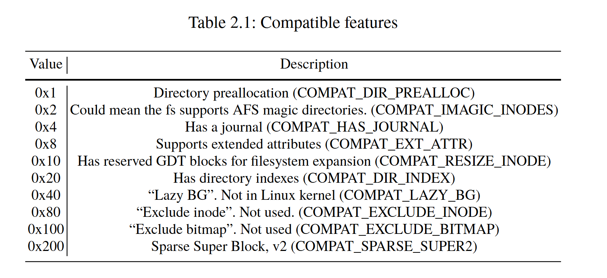

incompatible feature:  

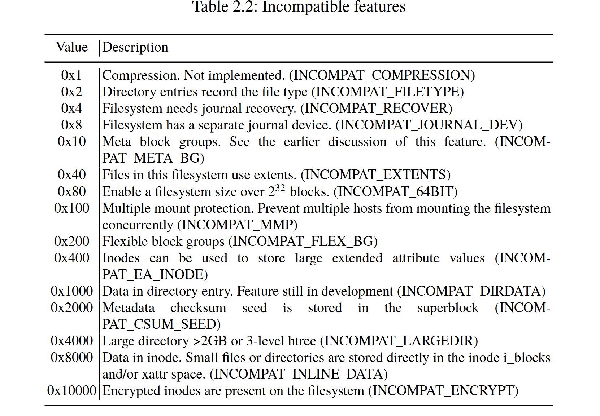


### flex group

Flexible block groups are a unique way of organizing block groups into a set of flex
groups. The first block of a flex group will include the bitmaps and the inode table for
all groups within all the flex groups, and the other groups may contain super blocks and group descriptors depending on the sparse superblock feature, and will include
data block

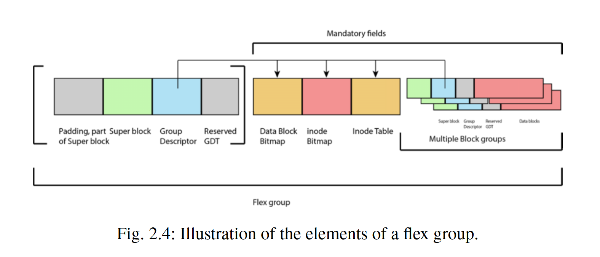


### inode

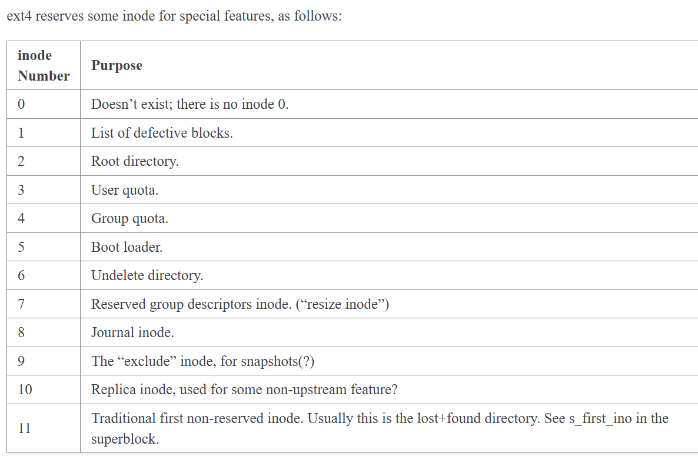

``` c
/*
 * Structure of an inode on the disk
 */
struct ext4_inode {
	__le16	i_mode;		/* File mode */
	__le16	i_uid;		/* Low 16 bits of Owner Uid */
	__le32	i_size_lo;	/* Size in bytes */
	__le32	i_atime;	/* Access time */
	__le32	i_ctime;	/* Inode Change time */
	__le32	i_mtime;	/* Modification time */
	__le32	i_dtime;	/* Deletion Time */
	__le16	i_gid;		/* Low 16 bits of Group Id */
	__le16	i_links_count;	/* Links count */
	__le32	i_blocks_lo;	/* Blocks count */
	__le32	i_flags;	/* File flags */
	union {
		struct {
			__le32  l_i_version;
		} linux1;
		struct {
			__u32  h_i_translator;
		} hurd1;
		struct {
			__u32  m_i_reserved1;
		} masix1;
	} osd1;				/* OS dependent 1 */
	__le32	i_block[EXT4_N_BLOCKS];/* Pointers to blocks */
	__le32	i_generation;	/* File version (for NFS) */
	__le32	i_file_acl_lo;	/* File ACL */
	__le32	i_size_high;
	__le32	i_obso_faddr;	/* Obsoleted fragment address */
	union {
		struct {
			__le16	l_i_blocks_high; /* were l_i_reserved1 */
			__le16	l_i_file_acl_high;
			__le16	l_i_uid_high;	/* these 2 fields */
			__le16	l_i_gid_high;	/* were reserved2[0] */
			__le16	l_i_checksum_lo;/* crc32c(uuid+inum+inode) LE */
			__le16	l_i_reserved;
		} linux2;
		struct {
			__le16	h_i_reserved1;	/* Obsoleted fragment number/size which are removed in ext4 */
			__u16	h_i_mode_high;
			__u16	h_i_uid_high;
			__u16	h_i_gid_high;
			__u32	h_i_author;
		} hurd2;
		struct {
			__le16	h_i_reserved1;	/* Obsoleted fragment number/size which are removed in ext4 */
			__le16	m_i_file_acl_high;
			__u32	m_i_reserved2[2];
		} masix2;
	} osd2;				/* OS dependent 2 */
	__le16	i_extra_isize;
	__le16	i_checksum_hi;	/* crc32c(uuid+inum+inode) BE */
	__le32  i_ctime_extra;  /* extra Change time      (nsec << 2 | epoch) */
	__le32  i_mtime_extra;  /* extra Modification time(nsec << 2 | epoch) */
	__le32  i_atime_extra;  /* extra Access time      (nsec << 2 | epoch) */
	__le32  i_crtime;       /* File Creation time */
	__le32  i_crtime_extra; /* extra FileCreationtime (nsec << 2 | epoch) */
	__le32  i_version_hi;	/* high 32 bits for 64-bit version */
	__le32	i_projid;	/* Project ID */
};

```
| Offset |Size|Name|Description
| --- | ---| ---| ---|
| 0x00  | 0x2 | i_mode| User privileges and type of file
| 0x02  | 0x2 | i_uid|Lower 16 bits of the owner id
| 0x04  | 0x4 | i_size_lo| Lower 32 bits of the file size
| 0x08  | 0x4 | i_atime |Last access time
| 0x0C  | 0x4 | i_ctime|Last inode change time
| 0x10  | 0x4 | i_mtime| Last data modification time
| 0x14  | 0x4 | i_dtime |Deletion time
| 0x18  | 0x2 | i_gid Lower |16 bits of group id
| 0x1A  | 0x2 | i_links_count |Number of hard links pointing to this file
| 0x1C  | 0x4 | i_blocks_lo Lower| 32 bits of 512 byte blocks this file uses
| 0x20  | 0x4 | i_flags |Inode flags
| 0x24  | 0x4 | i_osd1| For Linux this is the inode version
| 0x28  | 0x3C | i_block[]| Block map or Extent tree.
| 0x64  | 0x4 | i_generation| File version for NFS
| 0x68  | 0x4 | i_file_acl_lo| Lower 32 bit address of extended attribute block
| 0x6C  | 0x4 | i_size_high| Higher 32 bit address of file size
| 0x70  | 0x4 | i_obso_faddr| Obsolete fragment address
| 0x74  | 0xC | i_osd2| OS descriptor 2
| 0x80  | 0x2 | i_extra_isize| Size of the used are of inode - 128
| 0x82  | 0x2 | i_checksum_hi| Upper 16-bits of the inode checksum
| 0x84  | 0x4 | i_ctime_extra| Extra change time bits
| 0x88  | 0x4 | i_mtime_extra| Extra modification time bits
| 0x8C  | 0x4 | i_atime_extra| Extra access time bits
| 0x90  | 0x4 | i_crtime| File creation time, in seconds since the Unix Epoch
| 0x94  | 0x4 | i_crtime_extra| Extra file creation time bits
| 0x98  | 0x4 | i_version_hi| Upper 32-bits for version number
| 0x9C  | 0x4 | i_projid| Project ID


#### i_mode

the i_mode field name 12 least significant bits are used for user privileges:  

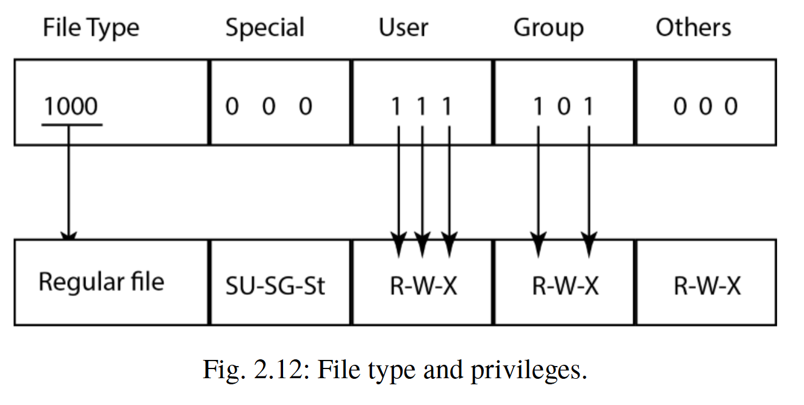

The 3 most significant bits are special privileges. Here they are 000, and it means the Set-UID, Set-GID, and the Sticky
- Set-UID  makes sure an executable uses the owner as the user executing the file and not the
actual user executing it
- Set-GID  using the defined group id for this file as the executable group instead of the real user group assigned to the user executing the file  
- Sticky  If it is set, it means that all files within this directory can only be modified by the owner

The remainder 4 bits of the i_mode field are for describing the type of file. An inode can describe a regular file, a directory, a device (character-based or block-based), a symbolic link, a named pipe (FIFO) or a socket

|4 MSb| Meaning |
|---|---|
|0001 |Special FIFO file (named pipe)|
|0010 |Character device|
|0100 |Directory|
|0110 |Block device|
|1000 |Regular file|
|1010 |Symbolic link|
|1100 |Socket|


#### i_links_count

The field i_links_count shows the number of directory entries referring to this inode. The directory entry has the inode number to which inode it points to. 

#### i_blocks_lo

The number of 512 byte blocks (sectors) used by a file is defined in the i_blocks_lo field. except for inode` i_flags` has the `EXT4_HUGE_FILE_FL` file option set.

#### i_flags

- 0x10 File is immutable, which means the file can not be changed.
- 0x20 File can only be appended.
- 0x80 Does not update access time. This is important because we know this timestamp is no longer updated on access.
- 0x800 Encrypted inode, which means the file content is encrypted.
- 0x4000 File data must be written through the journal. This is important since the previous content from this file may be found in the journal as long as the journal has not been not overwritten with new transactions. This also depends on what is being recorded to the journal.
- 0x40000 This is a huge file, which has special meaning when computing the block size of a file.
- 0x80000 The file uses extents, which we explain in sect. 2.4.5. If this is not set it may use direct or indirect block pointers.
- 0x10000000 The inode contains inline data.
- 0x20000000 Create children with the same Project ID.

#### i_generation
The `i_generation` is meant to be used for NFS (Network File System) and a random
value will be created for every new file created.  

If the value is not zero, and the creation date `crtime` of the
two inodes are equal and found in the same file system, then they are both describing
the same inode.  
If we have found an inode that obviously is deleted in the
inode table, finding previous versions of this inode can give us the previous extents in a non deleted state, allowing recovery of a previous state of this file
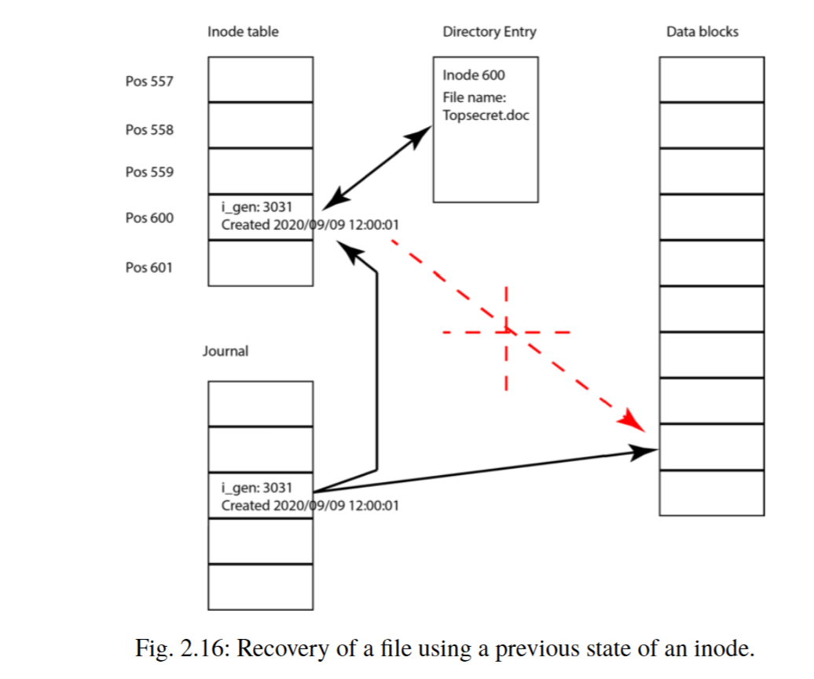

### directory entry

``` c
struct ext4_dir_entry {
	__le32	inode;			/* Inode number */
	__le16	rec_len;		/* Directory entry length */
	__le16	name_len;		/* Name length */
	char	name[EXT4_NAME_LEN];	/* File name */
};
```
### blockmap && extent tree

#### block map

the way used by previous Ext version: direct and indirect block pointers, like:  

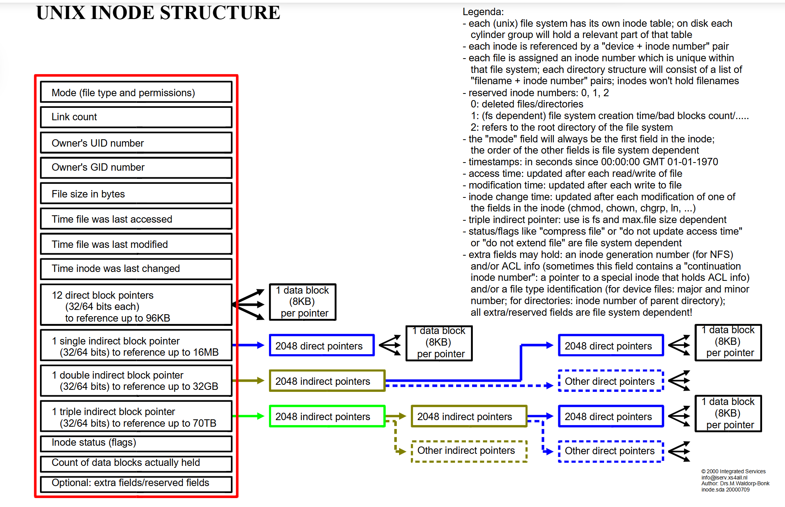

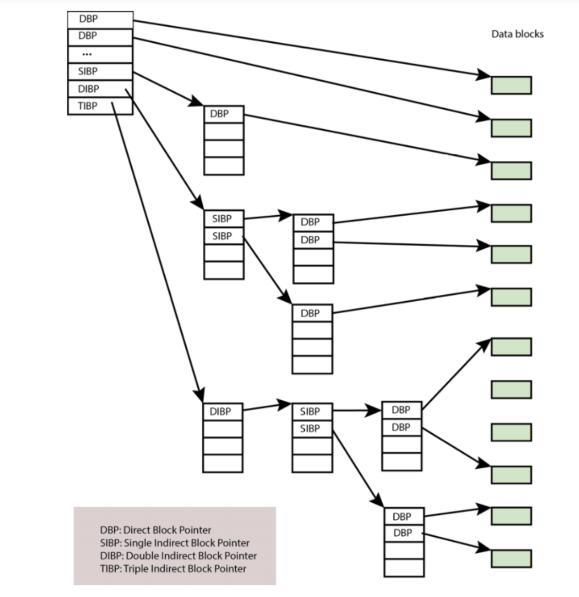

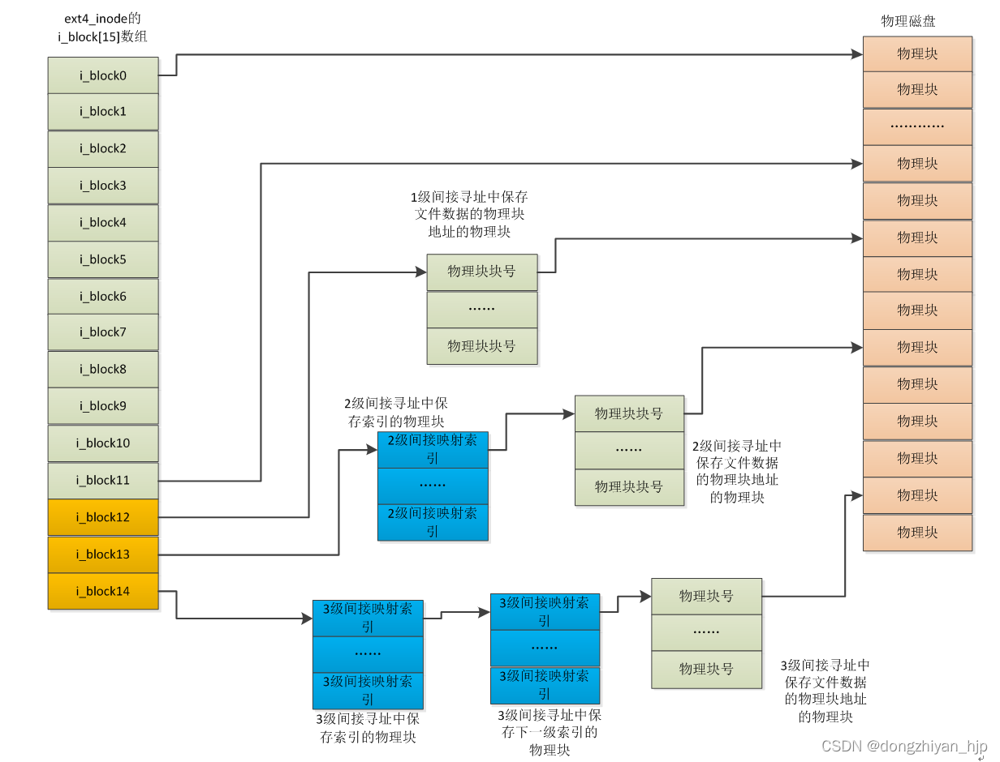

#### extent tree

extent tree :   
https://blog.csdn.net/hu1610552336/article/details/128509011
https://blog.csdn.net/hu1610552336/article/details/128509145?spm=1001.2014.3001.5502
https://blog.csdn.net/hu1610552336/article/details/128509285?spm=1001.2014.3001.5502
https://zhuanlan.zhihu.com/p/21441932933

``` c

/*
 * This is the extent on-disk structure.
 * It's used at the bottom of the tree.
 */
struct ext4_extent {
	__le32	ee_block;	/* first logical block extent covers */
	__le16	ee_len;		/* number of blocks covered by extent */
	__le16	ee_start_hi;	/* high 16 bits of physical block */
	__le32	ee_start_lo;	/* low 32 bits of physical block */
};

```
一个ext4_extent可以表示一段逻辑块地址 `ee_block ~ ee_block + ee_len ` 和 一段物理块地址的映射关系  
所有的ext4_extent是用一个b+树维护的，关键索引结构如下：

``` c

/*
 * This is index on-disk structure.
 * It's used at all the levels except the bottom.
 */
struct ext4_extent_idx {
	__le32	ei_block;	/* index covers logical blocks from 'block' */
	__le32	ei_leaf_lo;	/* pointer to the physical block of the next *
				 * level. leaf or next index could be there */
	__le16	ei_leaf_hi;	/* high 16 bits of physical block */
	__u16	ei_unused;
};

/*
 * Each block (leaves and indexes), even inode-stored has header.
 */
struct ext4_extent_header {
	__le16	eh_magic;	/* probably will support different formats */
	__le16	eh_entries;	/* number of valid entries */
	__le16	eh_max;		/* capacity of store in entries */
	__le16	eh_depth;	/* has tree real underlying blocks? */
	__le32	eh_generation;	/* generation of the tree */
};


```

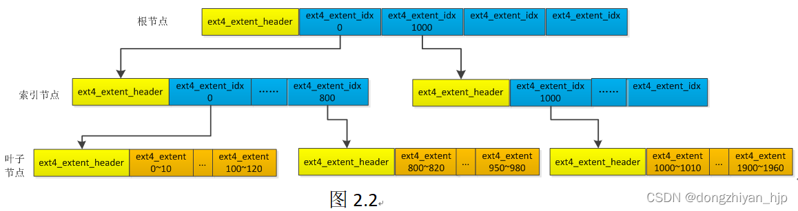


page size and block size of ext4: **4k**  
After the header, the extent entries will follow. These are either extents pointing
to new extent indexes or to the /data blocks containing the file content itself. If
the extent header `eh_depth` is larger than zero, the extent index entries will point to blocks containing other extent entries. If the `eh_depth` is equal to zero, then the
extent describes and points to the blocks containing the file content.

checksum:  
After the last extent entry, there is a checksum named eb_checksum which is
computed by using the file system uuid (from the superblock)+inum (from the directory entry)+igeneration (from the inode)+extent block (not including the checksum).
This checksum is not necessary since the inode is already checksummed . This
checksum can be computed using the crc32c algorithm to identify manipulation
attempts . A crc32c library can be used to test this checksum .

##### source code 


``` c
int ext4_ext_map_blocks(handle_t *handle, struct inode *inode,
			struct ext4_map_blocks *map, int flags)
```
为逻辑地址建立到物理地址的映射关系，必要时分配新物理块(连续)

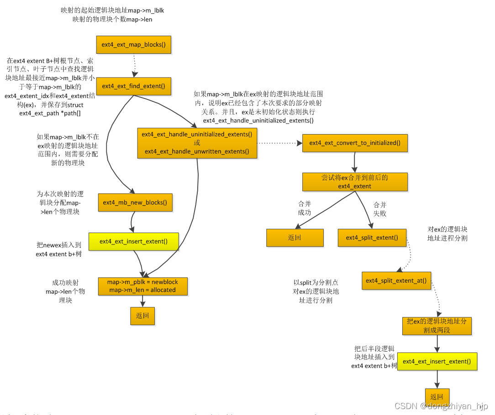
``` c
struct ext4_ext_path * ext4_find_extent(struct inode *inode, ext4_lblk_t block,
		 struct ext4_ext_path **orig_path, int flags)

```
该函数根据ext4 extent B+树的根节点的ext4_extent_header，先找到每一层索引节点中起始逻辑块地址最接近传入的逻辑块地址block的ext4_extent_idx保存到path[ppos]->p_idx.然后找到最后一层的叶子节点中起始逻辑块地址最接近传入的逻辑块地址block的ext4_extent，保存到path[ppos]->p_ext  
二分查找


``` c
static int ext4_ext_convert_to_initialized(handle_t *handle,
					   struct inode *inode,
					   struct ext4_map_blocks *map,
					   struct ext4_ext_path **ppath,
					   int flags)
```

convert a discovered unwritten extent to written  
可能发生左合并或者右合并，基于写入位置可能产生分裂(extent分裂成2或者3个节点)

``` c
	/*
	 * five cases:
	 * 1. split the extent into three extents.
	 * 2. split the extent into two extents, zeroout the head of the first
	 *    extent.
	 * 3. split the extent into two extents, zeroout the tail of the second
	 *    extent.
	 * 4. split the extent into two extents with out zeroout.
	 * 5. no splitting needed, just possibly zeroout the head and / or the
	 *    tail of the extent.
	 */
```

``` c
/*
 * ext4_split_extents() splits an extent and mark extent which is covered
 * by @map as split_flags indicates
 *
 * It may result in splitting the extent into multiple extents (up to three)
 * There are three possibilities:
 *   a> There is no split required
 *   b> Splits in two extents: Split is happening at either end of the extent
 *   c> Splits in three extents: Somone is splitting in middle of the extent
 *
 */
static int ext4_split_extent(handle_t *handle,
			      struct inode *inode,
			      struct ext4_ext_path **ppath,
			      struct ext4_map_blocks *map,
			      int split_flag,
			      int flags)
```

当map_blocks和ex起始位置和长度相等时，不会发生分裂  
在边界会分割成两个extent  
在中间会分割成三个extent  

``` c
/*
 * ext4_ext_insert_extent:
 * tries to merge requested extent into the existing extent or
 * inserts requested extent as new one into the tree,
 * creating new leaf in the no-space case.
 */
int ext4_ext_insert_extent(handle_t *handle, struct inode *inode,
				struct ext4_ext_path **ppath,
				struct ext4_extent *newext, int gb_flags)
```

### journal

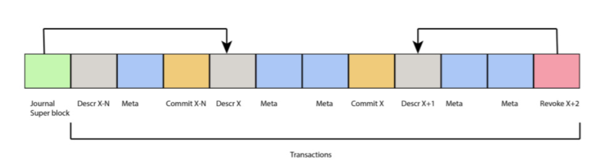

The journal is normally found in `inode number 8`, but can be placed in any other
inode defined in the superblock.  

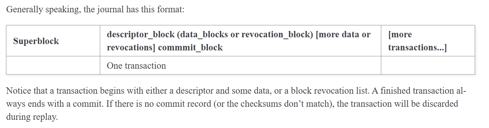
https://www.kernel.org/doc/html/latest/filesystems/ext4/journal.html  

Once the important data transaction is fully written to the disk and flushed from the disk write cache, a record of the data being committed is also written to the journal. At some later point in time, the journal code writes the transactions to their final locations on disk (this could involve a lot of seeking or a lot of small read-write-erases) before erasing the commit record. Should the system crash during the second slow write, the journal can be replayed all the way to the latest commit record, guaranteeing the atomicity of whatever gets written through the journal to the disk. The effect of this is to guarantee that the filesystem does not become stuck midway through a metadata update.  
For performance reasons, ext4 by default only writes filesystem metadata through the journal. This means that file data blocks are /not/ guaranteed to be in any consistent state after a crash.  
All fields in jbd2 are written to disk in big-endian order.  

block header:  
Every block in the journal starts with a common 12-byte header struct `journal_header_s`:(for every descriptor block)
```c
/*
 * Standard header for all descriptor blocks:
 */
typedef struct journal_header_s
{
	__be32		h_magic;
	__be32		h_blocktype;
	__be32		h_sequence;
} journal_header_t;

```

journal superblock:  
```c
/*
 * The journal superblock.  All fields are in big-endian byte order.
 */
typedef struct journal_superblock_s
{
/* 0x0000 */
	journal_header_t s_header;

/* 0x000C */
	/* Static information describing the journal */
	__be32	s_blocksize;		/* journal device blocksize */
	__be32	s_maxlen;		/* total blocks in journal file */
	__be32	s_first;		/* first block of log information */

/* 0x0018 */
	/* Dynamic information describing the current state of the log */
	__be32	s_sequence;		/* first commit ID expected in log */
	__be32	s_start;		/* blocknr of start of log */

/* 0x0020 */
	/* Error value, as set by jbd2_journal_abort(). */
	__be32	s_errno;

/* 0x0024 */
	/* Remaining fields are only valid in a version-2 superblock */
	__be32	s_feature_compat;	/* compatible feature set */
	__be32	s_feature_incompat;	/* incompatible feature set */
	__be32	s_feature_ro_compat;	/* readonly-compatible feature set */
/* 0x0030 */
	__u8	s_uuid[16];		/* 128-bit uuid for journal */

/* 0x0040 */
	__be32	s_nr_users;		/* Nr of filesystems sharing log */

	__be32	s_dynsuper;		/* Blocknr of dynamic superblock copy*/

/* 0x0048 */
	__be32	s_max_transaction;	/* Limit of journal blocks per trans.*/
	__be32	s_max_trans_data;	/* Limit of data blocks per trans. */

/* 0x0050 */
	__u8	s_checksum_type;	/* checksum type */
	__u8	s_padding2[3];
/* 0x0054 */
	__be32	s_num_fc_blks;		/* Number of fast commit blocks */
	__be32	s_head;			/* blocknr of head of log, only uptodate
					 * while the filesystem is clean */
/* 0x005C */
	__u32	s_padding[40];
	__be32	s_checksum;		/* crc32c(superblock) */

/* 0x0100 */
	__u8	s_users[16*48];		/* ids of all fs'es sharing the log */
/* 0x0400 */
} journal_superblock_t;
```

descriptor block:  
The descriptor block contains an array of journal block tags that describe the final locations of the data blocks that follow in the journal. Descriptor blocks are open-coded instead of being completely described by a data structure, but here is the block structure anyway. Descriptor blocks consume at least 36 bytes, but use a full block.

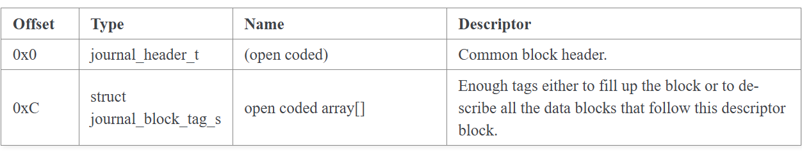
```c
typedef struct journal_block_tag_s
{
	__be32		t_blocknr;	/* The on-disk block number */
	__be16		t_checksum;	/* truncated crc32c(uuid+seq+block) */
	__be16		t_flags;	/* See below */
	__be32		t_blocknr_high; /* most-significant high 32bits. */
} journal_block_tag_t;
```
### layout of the block group
A block is a group of sectors between 1KiB and 64KiB, and the number of sectors must be an integral power of 2. Blocks are in turn grouped into larger units called block groups
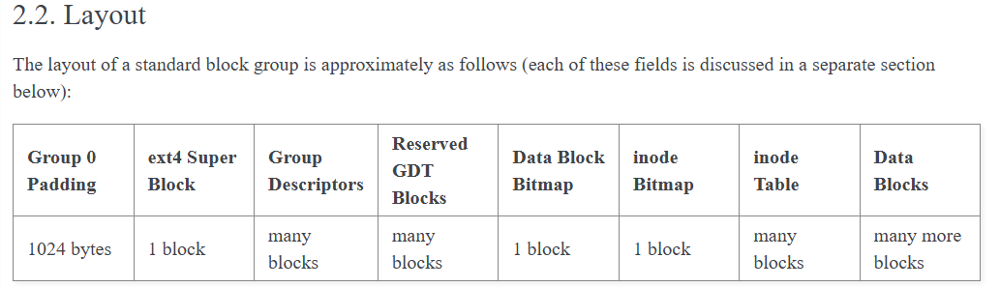  

super block:  
``` c
/*
 * Structure of the super block
 */
struct ext4_super_block {
/*00*/	__le32	s_inodes_count;		/* Inodes count */
	__le32	s_blocks_count_lo;	/* Blocks count */
	__le32	s_r_blocks_count_lo;	/* Reserved blocks count */
	__le32	s_free_blocks_count_lo;	/* Free blocks count */
/*10*/	__le32	s_free_inodes_count;	/* Free inodes count */
	__le32	s_first_data_block;	/* First Data Block */
	__le32	s_log_block_size;	/* Block size */
	__le32	s_log_cluster_size;	/* Allocation cluster size */
/*20*/	__le32	s_blocks_per_group;	/* # Blocks per group */
	__le32	s_clusters_per_group;	/* # Clusters per group */
	__le32	s_inodes_per_group;	/* # Inodes per group */
	__le32	s_mtime;		/* Mount time */
/*30*/	__le32	s_wtime;		/* Write time */
	__le16	s_mnt_count;		/* Mount count */
	__le16	s_max_mnt_count;	/* Maximal mount count */
	__le16	s_magic;		/* Magic signature */
	__le16	s_state;		/* File system state */
	__le16	s_errors;		/* Behaviour when detecting errors */
	__le16	s_minor_rev_level;	/* minor revision level */
/*40*/	__le32	s_lastcheck;		/* time of last check */
	__le32	s_checkinterval;	/* max. time between checks */
	__le32	s_creator_os;		/* OS */
	__le32	s_rev_level;		/* Revision level */
/*50*/	__le16	s_def_resuid;		/* Default uid for reserved blocks */
	__le16	s_def_resgid;		/* Default gid for reserved blocks */
	/*
	 * These fields are for EXT4_DYNAMIC_REV superblocks only.
	 *
	 * Note: the difference between the compatible feature set and
	 * the incompatible feature set is that if there is a bit set
	 * in the incompatible feature set that the kernel doesn't
	 * know about, it should refuse to mount the filesystem.
	 *
	 * e2fsck's requirements are more strict; if it doesn't know
	 * about a feature in either the compatible or incompatible
	 * feature set, it must abort and not try to meddle with
	 * things it doesn't understand...
	 */
	__le32	s_first_ino;		/* First non-reserved inode */
	__le16  s_inode_size;		/* size of inode structure */
	__le16	s_block_group_nr;	/* block group # of this superblock */
	__le32	s_feature_compat;	/* compatible feature set */
/*60*/	__le32	s_feature_incompat;	/* incompatible feature set */
	__le32	s_feature_ro_compat;	/* readonly-compatible feature set */
/*68*/	__u8	s_uuid[16];		/* 128-bit uuid for volume */
/*78*/	char	s_volume_name[EXT4_LABEL_MAX];	/* volume name */
/*88*/	char	s_last_mounted[64] __nonstring;	/* directory where last mounted */
/*C8*/	__le32	s_algorithm_usage_bitmap; /* For compression */
	/*
	 * Performance hints.  Directory preallocation should only
	 * happen if the EXT4_FEATURE_COMPAT_DIR_PREALLOC flag is on.
	 */
	__u8	s_prealloc_blocks;	/* Nr of blocks to try to preallocate*/
	__u8	s_prealloc_dir_blocks;	/* Nr to preallocate for dirs */
	__le16	s_reserved_gdt_blocks;	/* Per group desc for online growth */
	/*
	 * Journaling support valid if EXT4_FEATURE_COMPAT_HAS_JOURNAL set.
	 */
/*D0*/	__u8	s_journal_uuid[16];	/* uuid of journal superblock */
/*E0*/	__le32	s_journal_inum;		/* inode number of journal file */
	__le32	s_journal_dev;		/* device number of journal file */
	__le32	s_last_orphan;		/* start of list of inodes to delete */
	__le32	s_hash_seed[4];		/* HTREE hash seed */
	__u8	s_def_hash_version;	/* Default hash version to use */
	__u8	s_jnl_backup_type;
	__le16  s_desc_size;		/* size of group descriptor */
/*100*/	__le32	s_default_mount_opts;
	__le32	s_first_meta_bg;	/* First metablock block group */
	__le32	s_mkfs_time;		/* When the filesystem was created */
	__le32	s_jnl_blocks[17];	/* Backup of the journal inode */
	/* 64bit support valid if EXT4_FEATURE_INCOMPAT_64BIT */
/*150*/	__le32	s_blocks_count_hi;	/* Blocks count */
	__le32	s_r_blocks_count_hi;	/* Reserved blocks count */
	__le32	s_free_blocks_count_hi;	/* Free blocks count */
	__le16	s_min_extra_isize;	/* All inodes have at least # bytes */
	__le16	s_want_extra_isize; 	/* New inodes should reserve # bytes */
	__le32	s_flags;		/* Miscellaneous flags */
	__le16  s_raid_stride;		/* RAID stride */
	__le16  s_mmp_update_interval;  /* # seconds to wait in MMP checking */
	__le64  s_mmp_block;            /* Block for multi-mount protection */
	__le32  s_raid_stripe_width;    /* blocks on all data disks (N*stride)*/
	__u8	s_log_groups_per_flex;  /* FLEX_BG group size */
	__u8	s_checksum_type;	/* metadata checksum algorithm used */
	__u8	s_encryption_level;	/* versioning level for encryption */
	__u8	s_reserved_pad;		/* Padding to next 32bits */
	__le64	s_kbytes_written;	/* nr of lifetime kilobytes written */
	__le32	s_snapshot_inum;	/* Inode number of active snapshot */
	__le32	s_snapshot_id;		/* sequential ID of active snapshot */
	__le64	s_snapshot_r_blocks_count; /* reserved blocks for active
					      snapshot's future use */
	__le32	s_snapshot_list;	/* inode number of the head of the
					   on-disk snapshot list */
#define EXT4_S_ERR_START offsetof(struct ext4_super_block, s_error_count)
	__le32	s_error_count;		/* number of fs errors */
	__le32	s_first_error_time;	/* first time an error happened */
	__le32	s_first_error_ino;	/* inode involved in first error */
	__le64	s_first_error_block;	/* block involved of first error */
	__u8	s_first_error_func[32] __nonstring;	/* function where the error happened */
	__le32	s_first_error_line;	/* line number where error happened */
	__le32	s_last_error_time;	/* most recent time of an error */
	__le32	s_last_error_ino;	/* inode involved in last error */
	__le32	s_last_error_line;	/* line number where error happened */
	__le64	s_last_error_block;	/* block involved of last error */
	__u8	s_last_error_func[32] __nonstring;	/* function where the error happened */
#define EXT4_S_ERR_END offsetof(struct ext4_super_block, s_mount_opts)
	__u8	s_mount_opts[64];
	__le32	s_usr_quota_inum;	/* inode for tracking user quota */
	__le32	s_grp_quota_inum;	/* inode for tracking group quota */
	__le32	s_overhead_clusters;	/* overhead blocks/clusters in fs */
	__le32	s_backup_bgs[2];	/* groups with sparse_super2 SBs */
	__u8	s_encrypt_algos[4];	/* Encryption algorithms in use  */
	__u8	s_encrypt_pw_salt[16];	/* Salt used for string2key algorithm */
	__le32	s_lpf_ino;		/* Location of the lost+found inode */
	__le32	s_prj_quota_inum;	/* inode for tracking project quota */
	__le32	s_checksum_seed;	/* crc32c(uuid) if csum_seed set */
	__u8	s_wtime_hi;
	__u8	s_mtime_hi;
	__u8	s_mkfs_time_hi;
	__u8	s_lastcheck_hi;
	__u8	s_first_error_time_hi;
	__u8	s_last_error_time_hi;
	__u8	s_first_error_errcode;
	__u8    s_last_error_errcode;
	__le16  s_encoding;		/* Filename charset encoding */
	__le16  s_encoding_flags;	/* Filename charset encoding flags */
	__le32  s_orphan_file_inum;	/* Inode for tracking orphan inodes */
	__le32	s_reserved[94];		/* Padding to the end of the block */
	__le32	s_checksum;		/* crc32c(superblock) */
};
```

block group descriptors:  
  The descriptor block contains an array of journal block tags that describe the final locations of the data blocks that follow in the journal.

``` c
/*
 * Structure of a blocks group descriptor
 */
struct ext4_group_desc
{
	__le32	bg_block_bitmap_lo;	/* Blocks bitmap block */
	__le32	bg_inode_bitmap_lo;	/* Inodes bitmap block */
	__le32	bg_inode_table_lo;	/* Inodes table block */
	__le16	bg_free_blocks_count_lo;/* Free blocks count */
	__le16	bg_free_inodes_count_lo;/* Free inodes count */
	__le16	bg_used_dirs_count_lo;	/* Directories count */
	__le16	bg_flags;		/* EXT4_BG_flags (INODE_UNINIT, etc) */
	__le32  bg_exclude_bitmap_lo;   /* Exclude bitmap for snapshots */
	__le16  bg_block_bitmap_csum_lo;/* crc32c(s_uuid+grp_num+bbitmap) LE */
	__le16  bg_inode_bitmap_csum_lo;/* crc32c(s_uuid+grp_num+ibitmap) LE */
	__le16  bg_itable_unused_lo;	/* Unused inodes count */
	__le16  bg_checksum;		/* crc16(sb_uuid+group+desc) */
	__le32	bg_block_bitmap_hi;	/* Blocks bitmap block MSB */
	__le32	bg_inode_bitmap_hi;	/* Inodes bitmap block MSB */
	__le32	bg_inode_table_hi;	/* Inodes table block MSB */
	__le16	bg_free_blocks_count_hi;/* Free blocks count MSB */
	__le16	bg_free_inodes_count_hi;/* Free inodes count MSB */
	__le16	bg_used_dirs_count_hi;	/* Directories count MSB */
	__le16  bg_itable_unused_hi;    /* Unused inodes count MSB */
	__le32  bg_exclude_bitmap_hi;   /* Exclude bitmap block MSB */
	__le16  bg_block_bitmap_csum_hi;/* crc32c(s_uuid+grp_num+bbitmap) BE */
	__le16  bg_inode_bitmap_csum_hi;/* crc32c(s_uuid+grp_num+ibitmap) BE */
	__u32   bg_reserved;
};
```

block and inode bitmaps:  
The data block bitmap tracks the usage of data blocks within the block group.  
The inode bitmap records which entries in the inode table are in use.

## fs_initialize

1. fs initialize
2. mount fs

## inode & file

inode 和 file 之间的关系 

- inode 代表文件本身，而 file 代表进程对文件的访问实例。

- inode 在磁盘上存储元数据，即使所有进程都 close() 了文件，inode 仍然存在，直到文件被删除。

- file 仅在进程打开文件时存在，它记录进程的 f_pos 和 flags。

- 一个 inode 可能对应多个 file

- 不同进程 open("/foo/bar.txt") 时，每个进程都会生成一个 file 结构，但它们的 f_inode 都指向相同的 inode。

- file 结构存储的是进程私有的数据

- 每个进程都有自己的 f_pos，所以进程 A 读写文件 /foo/bar.txt 时，不会影响进程 B 读取相同的文件。


## qemu mmio 
https://blog.csdn.net/huang987246510/article/details/123101595  
https://blog.csdn.net/qq_48458789/article/details/141124876  

结合xv6的详解：
https://blog.csdn.net/qq_45226456/article/details/133583975  

virtio specification:  
https://docs.oasis-open.org/virtio/virtio/v1.2/csd01/virtio-v1.2-csd01.pdf#page=1.24