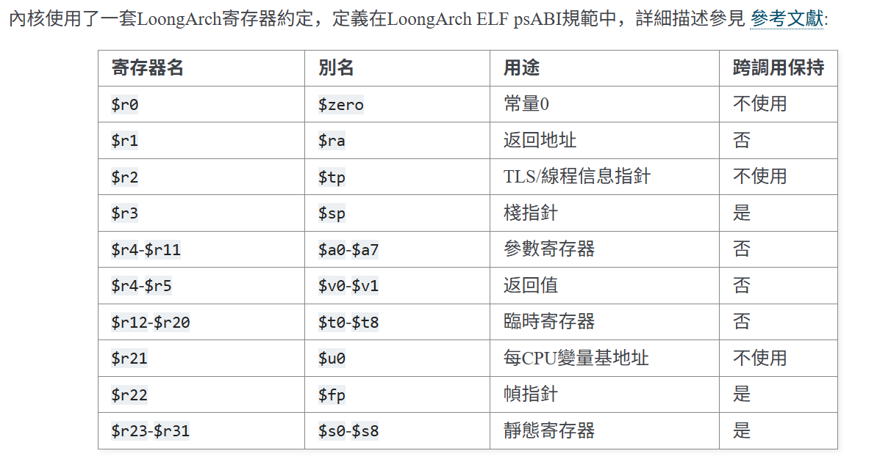
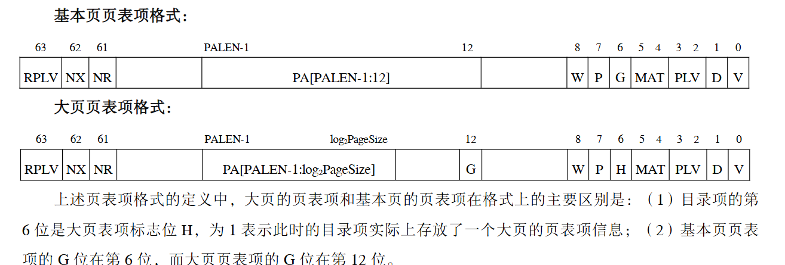

支持loongarch的一些参考资料：  
[2k1000A开发板官网](https://www.loongson.cn/product/show?id=8)  
[星云版规格书](https://file1.elecfans.com/web2/M00/82/51/wKgZomRJx4SAZXvAAAapZ6XEzcI828.pdf)  
[资料汇总](https://bbs.elecfans.com/jishu_2411734_1_1.html)  
[论文](https://dl.acm.org/doi/pdf/10.1145/3637494.3637495)  
[项目地址(包含详细文档)](https://gitlab.eduxiji.net/202310358111361/project1466467-176097#about-the-project)  
[loongarch指令集架构文档](https://loongson.github.io/LoongArch-Documentation/README-CN.html)   
[loongarch.h](https://gbmc.googlesource.com/linux/+/17bbde2e1716e2ee4b997d476b48ae85c5a47671/arch/loongarch/include/asm/loongarch.h)  
[寄存器总结](https://bbs.loongarch.org/d/51-3a5000)  
1. set DMW
2. 修改kernel.ld, 使得内核启动在直接映射窗口下。而用户使用虚拟地址进行页表映射
3. four-level pgtable, 修改页表相关的代码
4. 由于使用直接映射窗口，内核使用的虚拟地址应该重新规划.比方说kalloc中对xv6定义的物理地址进行分配，这里需要改成虚拟地址/
5. 用户和内核态之间无需切换页表（那么trampoline需要改写）
6. 中断处理部分设置好寄存器
7. memlayout
8. switch.S
9. entry.S
10. 异常的地址是由控制寄存器eentry指定的，看样子似乎必须是页对齐的？。。


## 中断

loongarch处理器依赖7A1000桥接片，中断处理器地址详见用户手册  
[csr,iocsr](https://github.com/jiegec/loongarch-csr)

## Regs




### CSR

#### STLBPS

用于配置 STLB 中页的大小  
- [5:0] STLB 的页大小的 2 的幂指数。例如，若页大小为 16KB，则 PS=0xE。
- [31:6] 保留域。读返回 0，且软件不允许改变其值

#### ASID

包含了用于访存操作和 TLB 指令的地址空间标识符（ASID）信息  
- [9:0] 当前执行的程序所对应的地址空间标识符  

#### TLBREHI

TLBREHI 寄存器是处于 TLB 重填例外上下文时（此时 CSR.TLBRERA.IsTLBR=1），存放 TLB 指令操
作时 TLB 表项低位部分物理页号等相关的信息
- [5:0] TLB 重填例外专用的页大小值。即在 CSR.TLBRERA.IsTLBR=1 时，执行 TLBWR 和
TLBFILL 指令，写入的 TLB 表项的 PS 域的值来自于此。

#### PWCL

该寄存器和 CSR.PWCH 寄存器中的信息在一起定义了操作系统中所采用的页表结构。这些信息将用于
指示软件或硬件进行页表遍历  
- [4:0] PTbase. 末级页表（第 0 级页表）的起始地址。
- [9:5] PTwidth. 末级页表（第 0 级页表）的索引位数.
- [14:10] Dir1_base. 最低一级目录（第 1 级页表）的起始地址。
- [19:15] Dir1_width. 最低一级目录（第 1 级页表）的索引位数。0 表示没有这一级。
- [24:20] Dir2_base. 次低一级目录（第 2 级页表）的起始地址。
- [29:15] Dir2_width. 次低一级目录（第 2 级页表）的索引位数。0 表示没有这一级。
- [31:30] PTEWidth. 内存中每个页表项的位宽。 0 表示 64 比特，1 表示 128 比特，2 表示 256 比特，3 表示 512 比特。

#### PWCH

该寄存器和 CSR.PWCL 寄存器中的信息在一起定义了操作系统中所采用的页表结构。这些信息将用于
指示软件或硬件进行页表遍历  

- [5:0] Dir3_base. 次高一级目录（第 3 级页表）的起始地址。
- [11:6] Dir3_width. 次高一级目录（第 3 级页表）的索引位数。0 表示没有这一级。
- [17:12] Dir4_base. 最高一级目录（第 4 级页表）的起始地址。
- [23:18] Dir4_width. 最高一级目录（第 4 级页表）的索引位数。0 表示没有这一级。
- [24] 当实现不支持硬件页表遍历（CPUCFG.2.HPTW[bit24]=0）时，读返回 0，且软件不允
许改变其值。当实现支持硬件页表遍历（CPUCFG.2.HPTW[bit24]=1）时，该位为硬件页表遍历功能
的使能位，置 1 开启，置 0 关闭。
- [31:25] 保留域。读返回 0，且软件不允许改变其值。  

虚拟地址的解析过程示例如下：  

1. 首先根据最高位选择CSR.PGDH或CSR.PGDL中的pgd，即目录4的基址  
2. 将虚拟地址中Dir4_base和Dir4_width指定范围的值作为索引，在目录4查找对应目录3的基址  
3. 将虚拟地址中Dir3_base和Dir3_width指定范围的值作为索引，在目录3查找对应目录2的基址
4. 将虚拟地址中Dir2_base和Dir2_width指定范围的值作为索引，在目录2查找对应目录1的基址  
5. 将虚拟地址中Dir1_base和Dir1_width指定范围的值作为索引，在目录1查找对应末级页表的基址  
6. 将虚拟地址中PTbase和PTwidth指定范围的值作为索引，在末级页表中查找最终页表项

## 存储访问类型

龙芯架构下支持三种存储访问类型，分别是：一致可缓存（Coherent Cached，简称 CC）、强序非缓存  
（Strongly-ordered UnCached，简称 SUC）和弱序非缓存（Weakly-ordered UnCached，简称 WUC）。存储访问类型与访存虚拟地址绑定，通过页表项中的 MAT（Memory Access Type）域决定。MAT 域的值域存储访问类型的对应关系是：0——强序非缓存，1——一致可缓存，2——弱序非缓存，3——保留。存储访问类型的设置过程对于应用软件是透明的。  
采用一致可缓存访问类型访问时，所访问的对象既可以是最终存储对象也可以是处理器中维护有缓存
一致性的缓存。通常采用这种访问类型访问内存以获得高性能。  
采用强序非缓存或弱序非缓存类型访问时，只能直接访问最终存储对象。两者的区别在于：强序非缓
存访问满足顺序一致性，即所有访问严格按照程序中的次序执行且当前访存操作彻底完成前不能开始执行
下一个访存操作；而弱序非缓存的读访问允许推测执行，弱序非缓存的写数据可以在处理器核内部合并至
更大的规模（如一个 Cache 行）后以突发（Burst）方式写出，合并过程中后面的写数据可以覆盖前面写数
据。  
龙芯架构下只要求强序非缓存类型的访存指令不能有副作用（Side Effect），即此类指令不可推测的执
行。软件可以利用这一特性通过强序非缓存类型的访存指令来访问系统中的 I/O 设备。但是，龙芯架构允许
强序非缓存类型的取指操作具有副作用。这是指，访问类型是强序非缓存类型的取指操作，即使它源自转
移预测的结果，也允许执行。为避免此类推测执行所产生的核外访存操作误入非法的物理地址空间，需要
在片上网络中过滤掉存在风险的访问。  
弱序非缓存类型的访问通常用于加速非缓存的内存数据的访问，如显存数据。  

## 页表项

1. ❖ 有效位(V)，1 比特。为 1 表明该页表项是有效的且被访问过的。
2. ❖ 脏位(D)，1 比特。为 1 表示该页表项项所对应的地址范围内已有脏数据。❖ 不可读位(NR)，1 比特。为 1 表示该页表项所在地址空间上不允许执行 load 操作。该控制位仅定义在 LA64 架构下。
3. ❖ 不可执行位(NX)，1 比特。为 1 表示该页表项所在地址空间上不允许执行取指操作。该控制位仅定义在 LA64 架构下。
4. ❖ 存储访问类型(MAT)，2 比特。控制落在该页表项所在地址空间上访存操作的存储访问类型。
5. ❖ 特权等级（PLV），2 比特。该页表项对应的特权等级。当 RPLV=0 时，该页表项可以被任何特权
等级不低于 PLV 的程序访问；当 RPLV=1 时，该页表项仅可以被特权等级等于 PLV 的程序访问。
6. ❖ 受限特权等级使能（RPLV），1 比特。页表项是否仅被对应特权等级的程序访问的控制位。请参
看上面 PLV 中的内容。该控制位仅定义在 LA64 架构下。

7. 物理页存在P
8. 可写W
9. 不可执行NX
10. 不可读NR
11. restricted privilege level enable, RPLV



## 设备树

一些地址映射可能和riscv不同，输出的设备树如下：  

```
zoe@sreyuim:~/rexvapor$ dtc -I dtb -O dts out.dtb
<stdout>: Warning (interrupt_provider): /pcie@20000000: Missing #interrupt-cells in interrupt provider
<stdout>: Warning (interrupt_provider): /msi@2ff00000: Missing #interrupt-cells in interrupt provider
<stdout>: Warning (interrupt_provider): /msi@2ff00000: Missing #address-cells in interrupt provider
<stdout>: Warning (interrupt_provider): /platic@10000000: Missing #address-cells in interrupt provider
<stdout>: Warning (interrupt_provider): /eiointc@1400: Missing #address-cells in interrupt provider
<stdout>: Warning (interrupt_provider): /cpuic: Missing #address-cells in interrupt provider
/dts-v1/;

/ {
        #size-cells = <0x02>;
        #address-cells = <0x02>;
        compatible = "linux,dummy-loongson3";

        platform-bus@16000000 {
                interrupt-parent = <0x8003>;
                ranges = <0x00 0x00 0x16000000 0x2000000>;
                #address-cells = <0x01>;
                #size-cells = <0x01>;
                compatible = "qemu,platform\0simple-bus";
        };

        poweroff {
                value = <0x34>;
                offset = <0x00>;
                regmap = <0x8005>;
                compatible = "syscon-poweroff";
        };

        reboot {
                value = <0x42>;
                offset = <0x02>;
                regmap = <0x8005>;
                compatible = "syscon-reboot";
        };

        ged@100e001c {
                phandle = <0x8005>;
                reg-io-width = <0x01>;
                reg-shift = <0x00>;
                reg = <0x00 0x100e001c 0x00 0x03>;
                compatible = "syscon";
        };

        rtc@100d0100 {
                interrupt-parent = <0x8003>;
                interrupts = <0x06 0x04>;
                reg = <0x00 0x100d0100 0x00 0x100>;
                compatible = "loongson,ls7a-rtc";
        };

        serial@1fe001e0 {
                interrupt-parent = <0x8003>;
                interrupts = <0x02 0x04>;
                clock-frequency = <0x5f5e100>;
                reg = <0x00 0x1fe001e0 0x00 0x100>;
                compatible = "ns16550a";
        };

        serial@1fe002e0 {
                interrupt-parent = <0x8003>;
                interrupts = <0x03 0x04>;
                clock-frequency = <0x5f5e100>;
                reg = <0x00 0x1fe002e0 0x00 0x100>;
                compatible = "ns16550a";
        };

        serial@1fe003e0 {
                interrupt-parent = <0x8003>;
                interrupts = <0x04 0x04>;
                clock-frequency = <0x5f5e100>;
                reg = <0x00 0x1fe003e0 0x00 0x100>;
                compatible = "ns16550a";
        };

        serial@1fe004e0 {
                interrupt-parent = <0x8003>;
                interrupts = <0x05 0x04>;
                clock-frequency = <0x5f5e100>;
                reg = <0x00 0x1fe004e0 0x00 0x100>;
                compatible = "ns16550a";
        };

        pcie@20000000 {
                interrupt-map-mask = <0x1800 0x00 0x00 0x07>;
                interrupt-map = <0x00 0x00 0x00 0x01 0x8003 0x10 0x00 0x00 0x00 0x02 0x8003 0x11 0x00 0x00 0x00 0x03 0x8003 0x12 0x00 0x00 0x00 0x04 0x8003 0x13 0x800 0x00 0x00 0x01 0x8003 0x11 0x800 0x00 0x00 0x02 0x8003 0x12 0x800 0x00 0x00 0x03 0x8003 0x13 0x800 0x00 0x00 0x04 0x8003 0x10 0x1000 0x00 0x00 0x01 0x8003 0x12 0x1000 0x00 0x00 0x02 0x8003 0x13 0x1000 0x00 0x00 0x03 0x8003 0x10 0x1000 0x00 0x00 0x04 0x8003 0x11 0x1800 0x00 0x00 0x01 0x8003 0x13 0x1800 0x00 0x00 0x02 0x8003 0x10 0x1800 0x00 0x00 0x03 0x8003 0x11 0x1800 0x00 0x00 0x04 0x8003 0x12>;
                msi-map = <0x00 0x8004 0x00 0x10000>;
                ranges = <0x1000000 0x00 0x4000 0x00 0x18004000 0x00 0xc000 0x2000000 0x00 0x40000000 0x00 0x40000000 0x00 0x40000000>;
                reg = <0x00 0x20000000 0x00 0x8000000>;
                dma-coherent;
                bus-range = <0x00 0x7f>;
                linux,pci-domain = <0x00>;
                #size-cells = <0x02>;
                #address-cells = <0x03>;
                device_type = "pci";
                compatible = "pci-host-ecam-generic";
        };

        msi@2ff00000 {
                loongson,msi-num-vecs = <0xe0>;
                loongson,msi-base-vec = <0x20>;
                interrupt-parent = <0x8002>;
                interrupt-controller;
                reg = <0x00 0x2ff00000 0x00 0x08>;
                compatible = "loongson,pch-msi-1.0";
                phandle = <0x8004>;
        };

        platic@10000000 {
                loongson,pic-base-vec = <0x00>;
                interrupt-parent = <0x8002>;
                #interrupt-cells = <0x02>;
                interrupt-controller;
                reg = <0x00 0x10000000 0x00 0x400>;
                compatible = "loongson,pch-pic-1.0";
                phandle = <0x8003>;
        };

        eiointc@1400 {
                reg = <0x00 0x1400 0x00 0x800>;
                interrupts = <0x03>;
                interrupt-parent = <0x8001>;
                #interrupt-cells = <0x01>;
                interrupt-controller;
                compatible = "loongson,ls2k2000-eiointc";
                phandle = <0x8002>;
        };

        cpuic {
                #interrupt-cells = <0x01>;
                interrupt-controller;
                compatible = "loongson,cpu-interrupt-controller";
                phandle = <0x8001>;
        };

        flash@1c000000 {
                bank-width = <0x04>;
                reg = <0x00 0x1c000000 0x00 0x1000000 0x00 0x1d000000 0x00 0x1000000>;
                compatible = "cfi-flash";
        };

        fw_cfg@1e020000 {
                dma-coherent;
                reg = <0x00 0x1e020000 0x00 0x18>;
                compatible = "qemu,fw-cfg-mmio";
        };

        memory@0 {
                device_type = "memory";
                reg = <0x00 0x00 0x00 0x8000000>;
        };

        cpus {
                #size-cells = <0x00>;
                #address-cells = <0x01>;

                cpu-map {

                        socket0 {

                                core0 {
                                        cpu = <0x8000>;
                                };
                        };
                };

                cpu@0 {
                        phandle = <0x8000>;
                        reg = <0x00>;
                        compatible = "loongarch,Loongson-3A5000";
                        device_type = "cpu";
                };
        };

        chosen {
                stdout-path = "/serial@1fe001e0";
                rng-seed = <0x1dab3d20 0xc0778122 0xad1455f8 0x3f2209ed 0x5f9a27e3 0xc6ccccb6 0xf2ed36fb 0x9989db41>;
        };
};

```

UART0串口：serial@1fe001e0  


## 磁盘读写

loongarch使用pci总线访问磁盘


## bugs

### bugs.1

[LOG][sched/proc.c,145,thread_mapstacks] thread 1 map with kstack base 0x00007fffffffe000, kstack top 0x00007ffffffbe000  

栈0x7fffffffdfa8中应该存$ra,但是存入的是0??  
为什么内核栈写不了呢？？？我不理解  

```asm


	# This writes 0xa8 to control register 0, setting the privilege level to 0, disabling interrupts, and disabling paging.
	li.w	$t0, 0x58		# PLV=0, IE=0, PG=0
	csrwr	$t0, 0x0

```

将CRMD配置改为0xa8。原本的直接地址翻译访存和取值方式为保留，现在修改后为一致可缓存。  
难道这个会引起硬件的未定义行为？  
因为事实上，我从来没有使用直接地址翻译模式，按理来说这个设置不会影响我的内核栈访存才对。。。  
但是现在这里没有报错了。。。


### bugs.2

pci & ahci驱动有问题！  


### 地址空间


但是读pci type0配置空间中所有数值都为0是怎么回事？，。。
