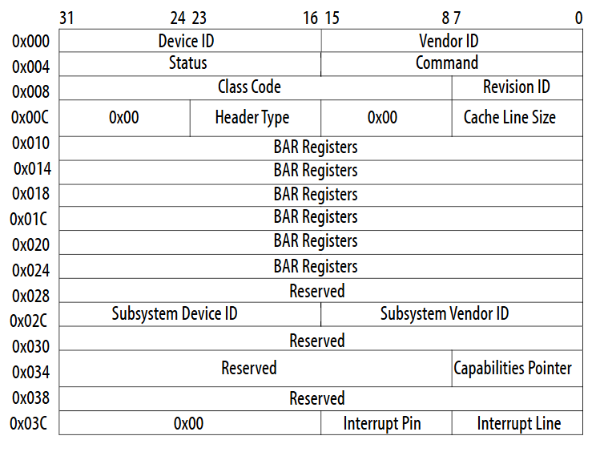

[PCI-PCIe](https://zhuanlan.zhihu.com/p/26172972)
[PCI驱动](https://www.cnblogs.com/LoyenWang/p/14165852.html)

1. Host Bridge，比如PC中常见的North Bridge（北桥）；  
图中处理器、Cache、内存子系统通过Host Bridge连接到PCI上，Host Bridge管理PCI总线域，是联系处理器和PCI设备的桥梁，完成处理器与PCI设备间的数据交换。其中数据交换，包含处理器访问PCI设备的地址空间和PCI设备使用DMA机制访问主存储器，在PCI设备用DMA访问存储器时，会存在Cache一致性问题，这个也是Host Bridge设计时需要考虑的；
此外，Host Bridge还可选的支持仲裁机制，热插拔等；

2. PCI Local Bus；  
PCI总线，由Host Bridge或者PCI-to-PCI Bridge管理，用来连接各类设备，比如声卡、网卡、IDE接口等。可以通过PCI-to-PCI Bridge来扩展PCI总线，并构成多级总线的总线树，比如图中的PCI Local Bus #0和PCI Local Bus #1两条PCI总线就构成一颗总线树，同属一个总线域；

3. PCI-To-PCI Bridge；  
PCI桥，用于扩展PCI总线，使采用PCI总线进行大规模系统互联成为可能，管理下游总线，并转发上下游总线之间的事务；

4. PCI Device；
PCI总线中有三类设备：PCI从设备，PCI主设备，桥设备。
PCI从设备：被动接收来自Host Bridge或者其他PCI设备的读写请求；
PCI主设备：可以通过总线仲裁获得PCI总线的使用权，主动向其他PCI设备或主存储器发起读写请求；  
桥设备：管理下游的PCI总线，并转发上下游总线之间的总线事务，包括PCI桥、PCI-to-ISA桥、PCI-to-Cardbus桥等。

