# linux :  
https://www.informit.com/articles/article.aspx?p=370047  

https://www.scaler.com/topics/linux-thread/

## thread_info

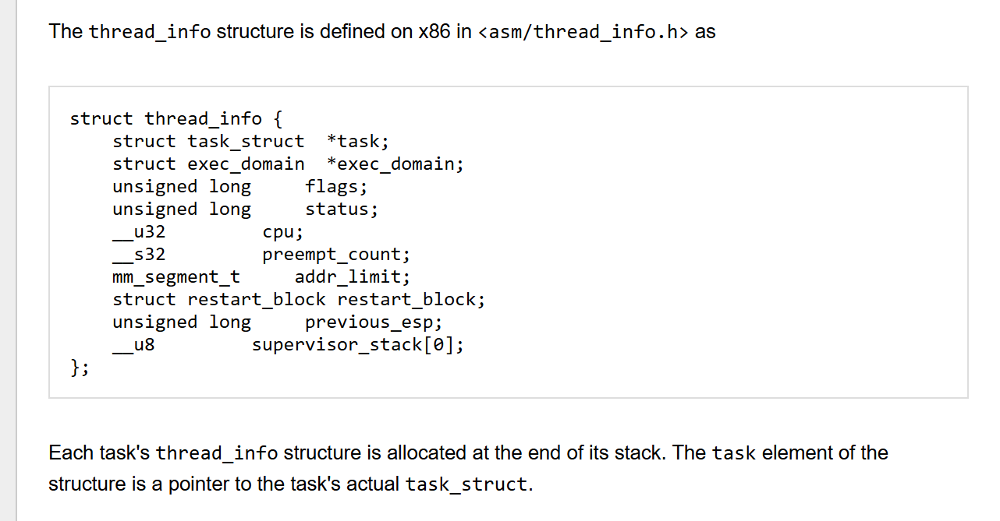

## state

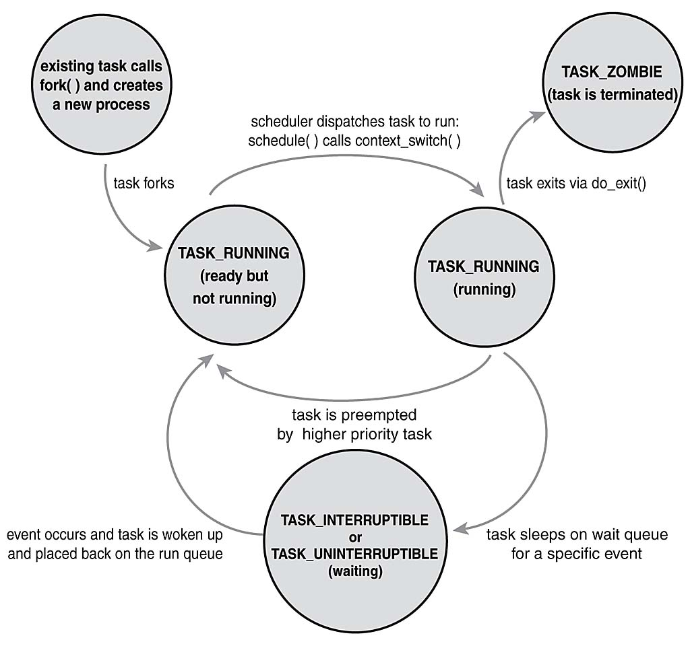

## process famaliy tree
**Each task_struct has a pointer to the parent's task_struct, named parent, and a list of children, named children.**  
比xv6的实现多了一个孩子链表

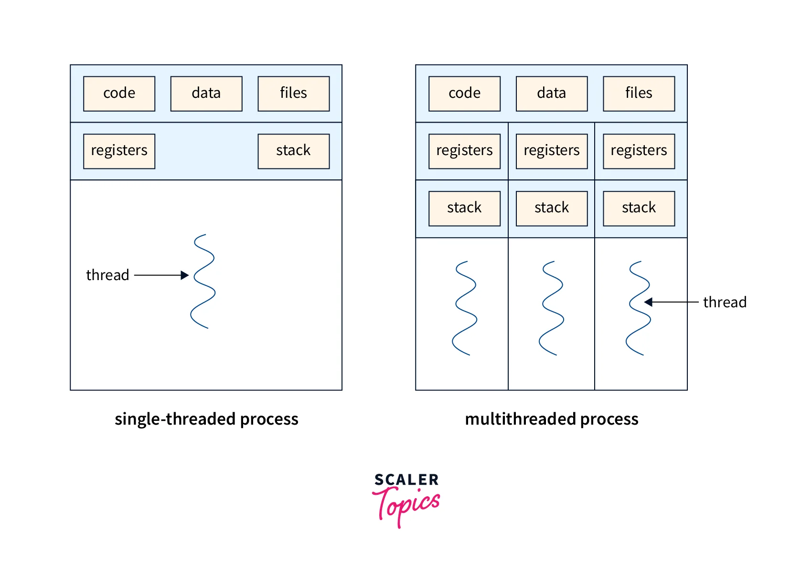


### 如何实现？

process作为最小的调度和资源分配单位 change to -->  

1. process作为一个最小的资源分配单位
2. thread作为一个最小的调度单位
3. 如何分配和管理内存？哪些内存由线程共享？
4. 线程的状态机应该是怎样的？互相之间如何切换？
5. 进程和进程之间的关系是怎样的？线程和线程之间的关系是怎样的？进程和线程之间的关系又是怎样的？用怎样的数据结构维护它们之间的关系？
6. 实现线程之后，fork()该复制哪些部分？-- 先默认拷贝leader-thread?
7. 线程的两态切换和上下文切换该如何做？和进程有何不同？

### thread state machine: (referencing lostwakeup)
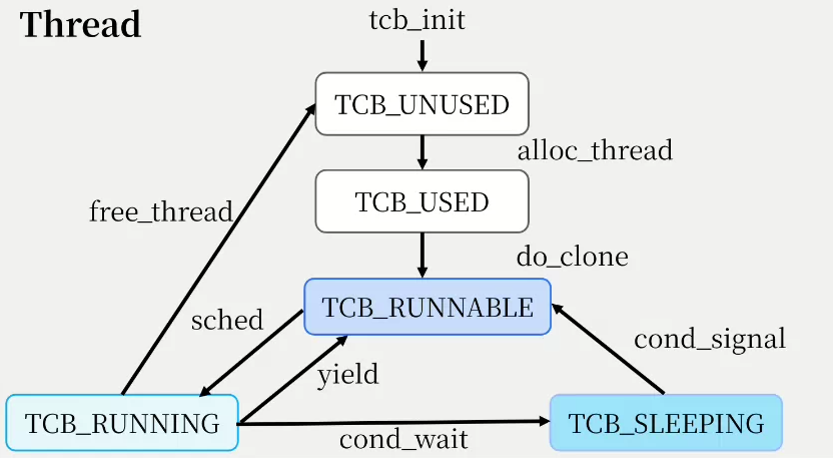  

thread states:  
1. unused   ：线程init后视为unused
2. used     ：alloc_thread创建的线程,但是尚未能运行（还未完全创建完毕）
3. runnable ：创建完成并且准备可以运行的线程
4. running  ：每个cpu进入thread_shed()之后，从runnable队列中选择线程进行调度，转为running
5. sleeping ：

### process state machine (referencing lostwakeup)
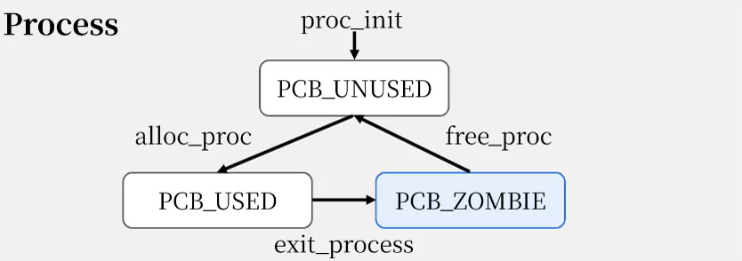

process state:  
1. unused   :资源已经被回收的进程
2. used     :只要进程上存在活着的线程，就将其视为used
3. zombie   :资源还未被父进程回收的进程

 **remember to change the state !!**, use the function `` tcb_q_change_state `` or  `` pcb_q_change_state ``

- 线程之间完全并行，也就是可以同时在多个CPU核上并行执行，而不是局限于在进程内部。由此应该需要一个全局的调度队列，而不是进程内部的调度队列。
- 为了实现线程间的完全并行，每个线程需要有自己的trapframe，而trampoline应当还是共享的
- 由于进程不作为调度单位，所以context应该放在每一个线程中
- swtch.s 需要修改，需要切换现成的上下文而非进程的上下文
- sched() and scheduler() ----> thread_sched() and scheduler() ,因为调度单位变化了，我们不再调度进程
- trap流程中所有trap的实体由进程改为线程


线程调度需要修改的部分:
1. initproc切换到sched()，以线程为执行单位进行调度
2. 注意原本进程的上下文应保存在线程中，主要包括trapframe中的寄存器状态


## exit

proc_exit()退出整个进程(将进程设为zombie状态，等待父进程回收资源)
而thread_exit()只退出单个线程
当最后一个线程调用thread_exit()时,会调用proc_exit()将进程设为zombie，并关闭所有文件。并且free当前线程.最后跳转到thread_sched()

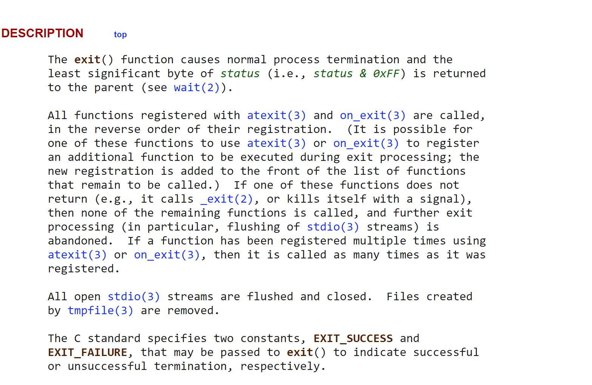

## wait 

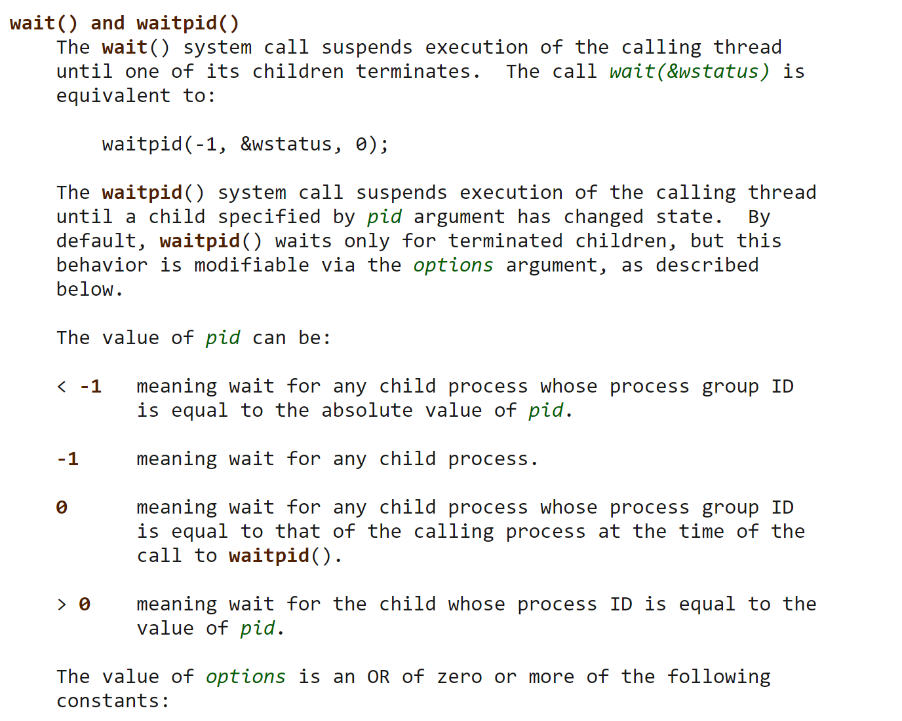

## 关于线程切换
swtch(&save_des, &des_context)存储callee-saved regs, 然后切换到目标的context：

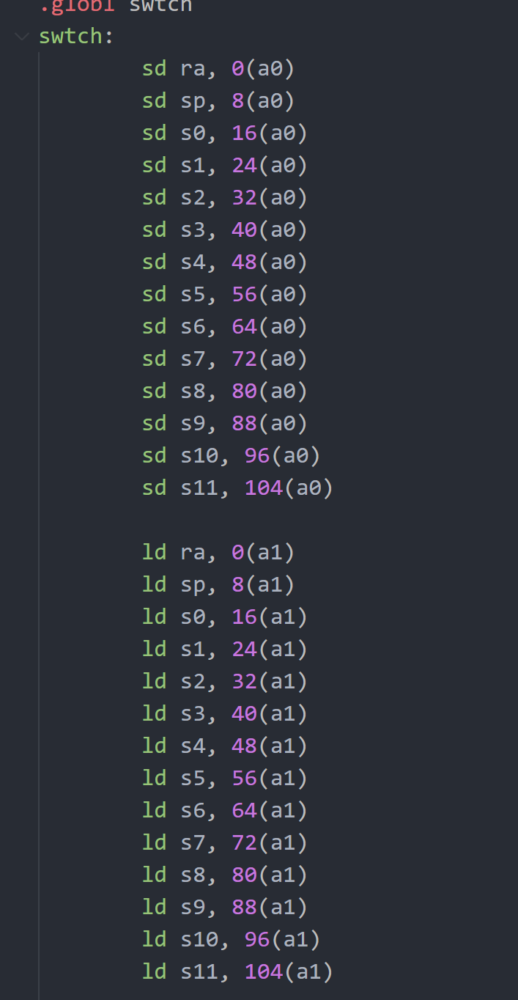

## wait_lock

Helps wait avoid lost wakeups

- wait函数需要找到自己的子进程，然后再进入sleep阶段，让出时钟，等待子进程唤醒。如果在 ***父进程尚且处在wait函数中，还未改变自己的状态为sleeping时*** 子进程退出，并且尝试唤醒了父进程，这个时候就会发生*lostwakeup*，所以为了防止这种情况：

1. 子进程在exit函数中wakeup父进程之前，先获取wait_lock
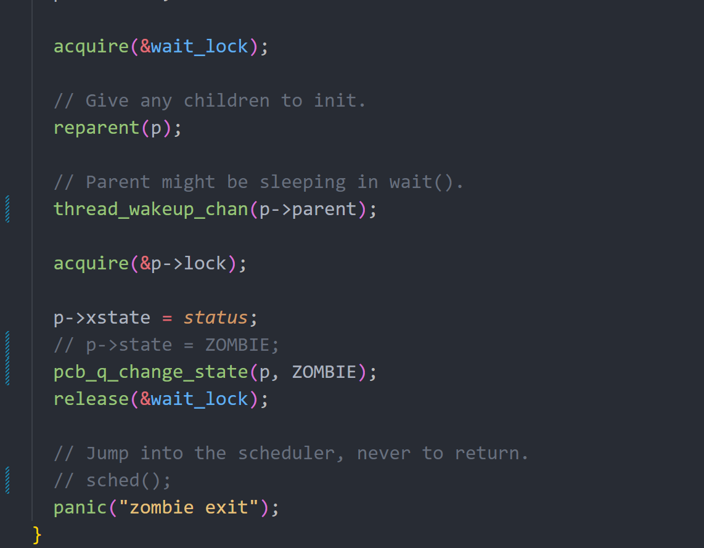
2. 父进程在sleep中，先获取进程锁，再释放wait_lock，保证父进程的状态不被改变。在改变完状态，即进入睡眠状态后，**带进程锁**进入`` sched() ``函数进行调度。该进程锁将在context swtch之后释放：
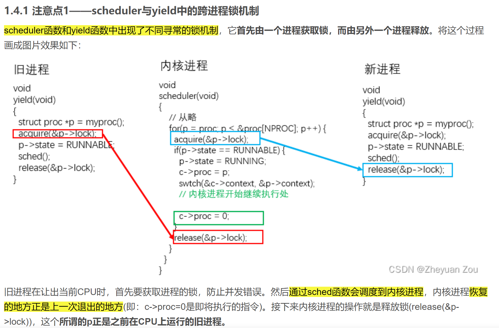
- 为什么context swtch之后原有的进程锁仍然可以访问？：  
- **sp（栈指针） 只影响当前正在运行的栈。
但是 p->lock 是在 p 的 struct proc 里，而 struct proc 存在堆或静态区，不在栈上，所以 p->lock 不受 sp 影响。**
- 注意，调用swtch时，ra和sp寄存器的切换实际上完成了控制流和数据流的切换
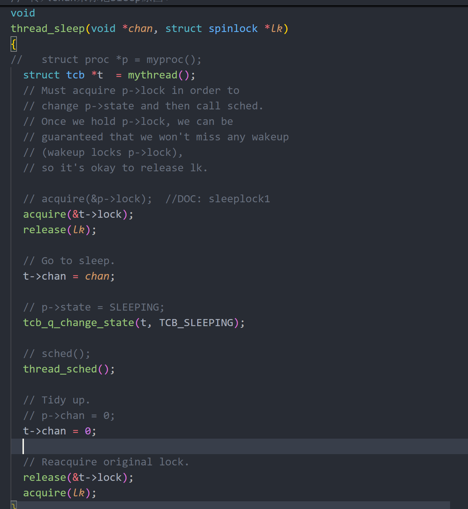
3. 子进程在wakeup父进程之前，必须先获取父进程锁
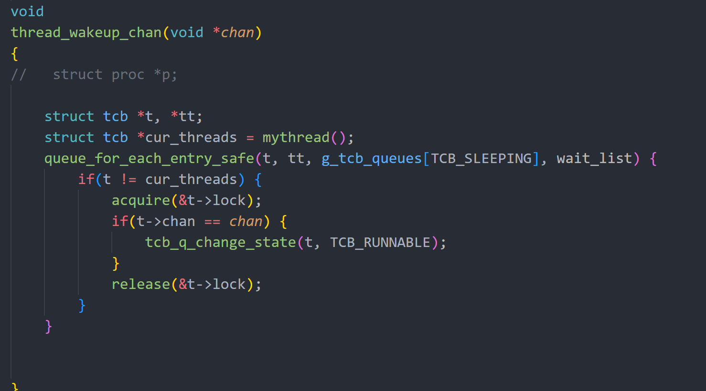


## xv6 原有的地址分配
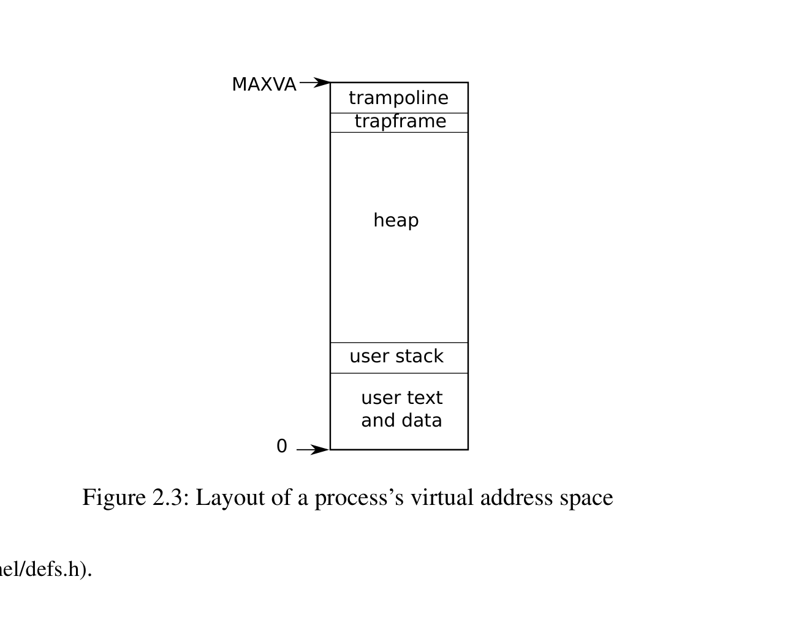
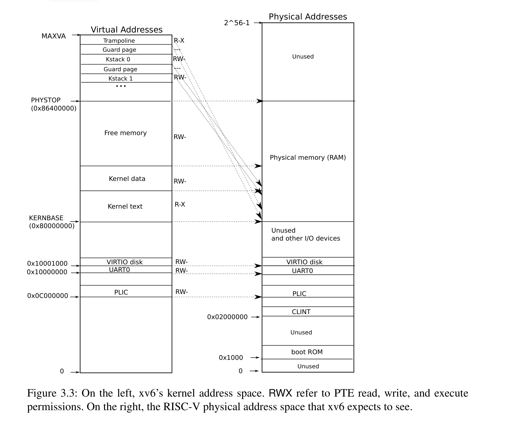

## 多线程

在XV6原有的设计中，由于不同进程间的页表不同，而且进程作为一个基本的调度单位：
- 每个进程拥有自己的trapframe
- 每个页表中存在一个相同虚拟地址TRAPFRAME到各自物理trapframe的映射
- trampoline.S中，每个进程可以通过TRAPFRAME宏定义找到他们的trapframe

由于可能有多个线程共享一个页表，所以使用同一个虚拟地址TRAPFRAME的设计就不再合理。同时，现在需要考虑如何让不同的线程找到自己的THREAD_TRAPFRAME,也就是需要建立一个**tidx(注意，是线程在thread_group中的索引，而非tid，因为tid是一个单调递增的计数值)**到THREAD_TRAPFRAME的映射关系:

```c
// thread-exclusive
#define THREAD_TRAPFRAME(idx) (TRAPFRAME - (idx)*PGSIZE)

```
-- 于是，此时一个进程中的每个线程有一个trapframe, 从
每个线程有自己的kernel stack：

```c

// now every single thread has its own kernel stack
// map kernel stacks beneath the trampoline,
// each surrounded by invalid guard pages.'
// KSTACK means KSTACK_BASE actrually 
#define KSTACK(t) (TRAMPOLINE - ((t)+1)* (KSTACK_PAGE + 1) *PGSIZE)

```

现在的问题在于，在`trampoline.S`中，每一个线程该如何找到自己的`THREAD_TRAPFRAME`?

- 原有的`uservec()`额外利用了一个`sscratch`寄存器来暂时使用`a0`
- 现在我们在进入`uservec()`时，要求`sscratch`寄存器中存放线程的`tid`，作为其相对`TRAPFRAME`的偏移
- ~~同时使用栈暂时保存中间需要使用的寄存器，最后再恢复中间寄存器，以及栈指针。~~
- 改用传参方式。首先使用栈需要显式设置`SSTATUS`寄存器`SUM`位，若未设置则一直trap死循环（血淋淋的教训）。其次破坏了用户栈的结构。再者此时的用户栈以及非特权寄存器应该被视为不安全的。
- `userret()`中同样使用`sscratch`存放偏移量。此时不需要保存内核的中间寄存器

## 第一个线程

`userinit() -> scheduler()(changes the context, which leads to thread_forkret()) -> thread_forkret() -> usertrapret() -> init.S() ->sys_exec()`  

- 在`scheduler()`中有一段时间cpu上是没有一个运行的进/线程抽象的！！
- swtch.S: 将当前CPU寄存器存入c->context(arg1)，ld regs from arg2

## thread 回收内存

`set t->killed` -> `usertrapret()`中检查 -> 线程`exit`