# 寄存器

https://tclin914.github.io/77838749/

## mepc

used for (machine-mode)trap return  
MRET then in mstatus/mstatush sets MPV=0, MPP=0, MIE=MPIE, and MPIE=1.
Lastly, MRET sets the privilege mode as previously determined, and sets pc=mepc
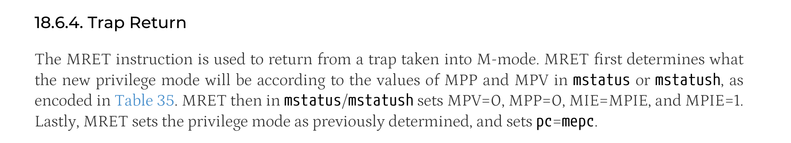

## sepc

**sepc[0] == 0**  
When a trap is taken into S-mode, sepc is written with the virtual address of the instruction that was
interrupted or that encountered the exception. Otherwise, sepc is never written by the  
implementation, though it may be explicitly written by software.
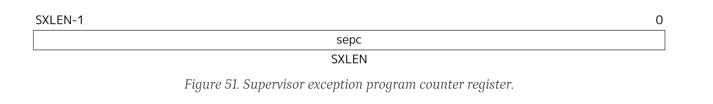

## sstatus

machine status register
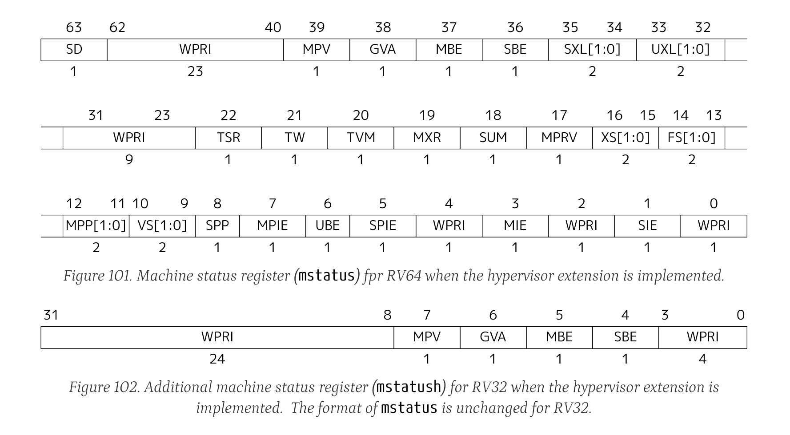

### some used bits:
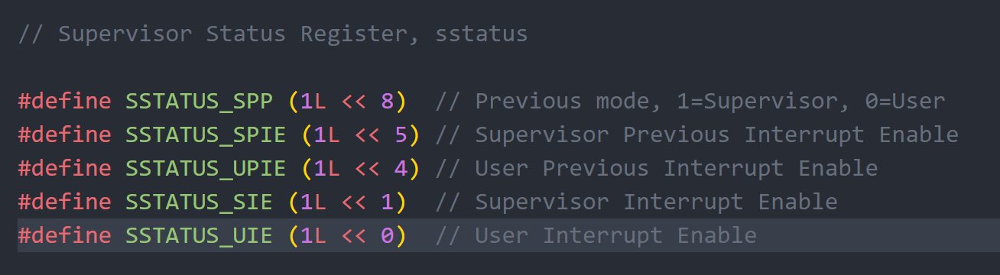
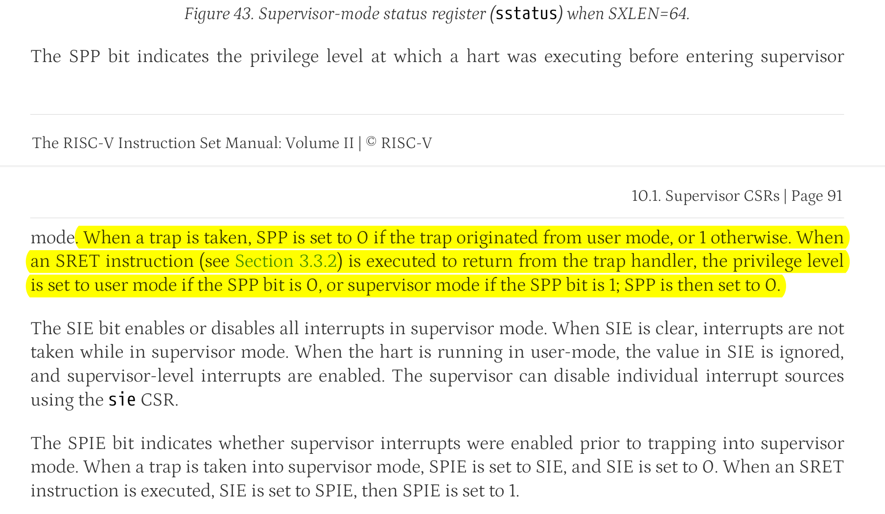
## sip && sie
supervisor interrupt register  
controling supervisor interrupt pending and enable respectively

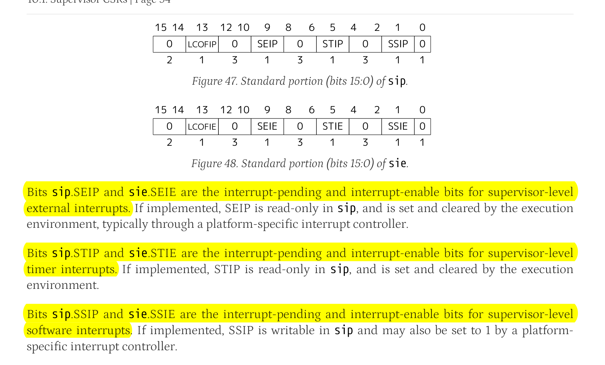
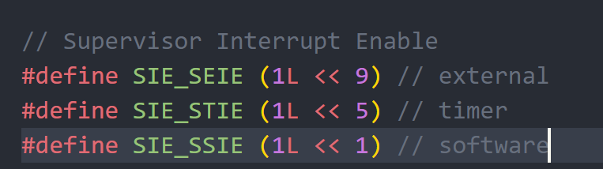

## mip && mie
machine interrupt pending / enable register  
The sip and sie registers are subsets of the mip and mie registers. Reading any
implemented field, or writing any writable field, of sip/sie effects a read or write of the
homonymous field of mip/mie

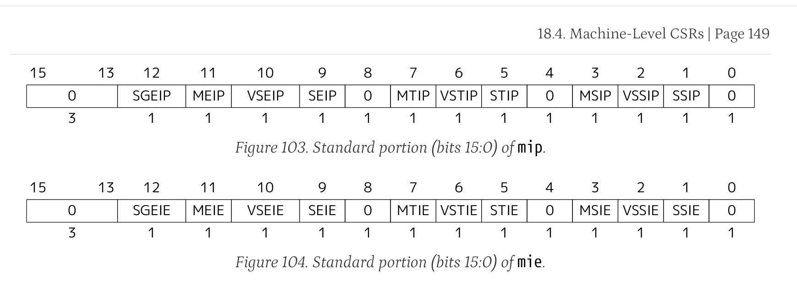
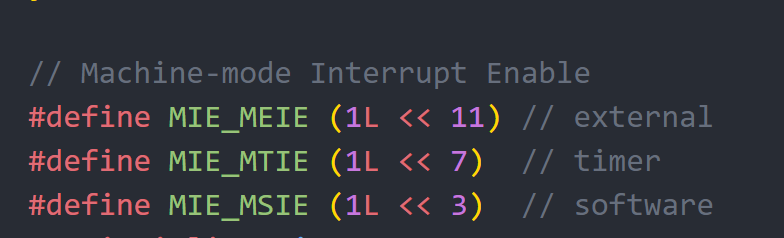

## scause

When a trap
is taken into S-mode, scause is written with a code indicating the event that caused the trap.
Otherwise, scause is never written by the implementation, though it may be explicitly written by
software.   
The Interrupt bit in the scause register is set if the trap was caused by an interrupt. The Exception
Code field contains a code identifying the last exception or interrupt.

### field:
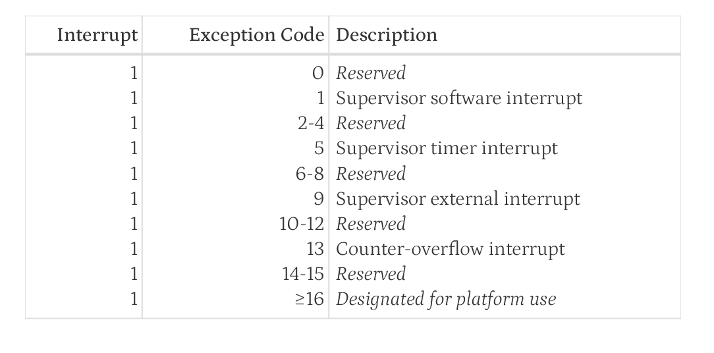
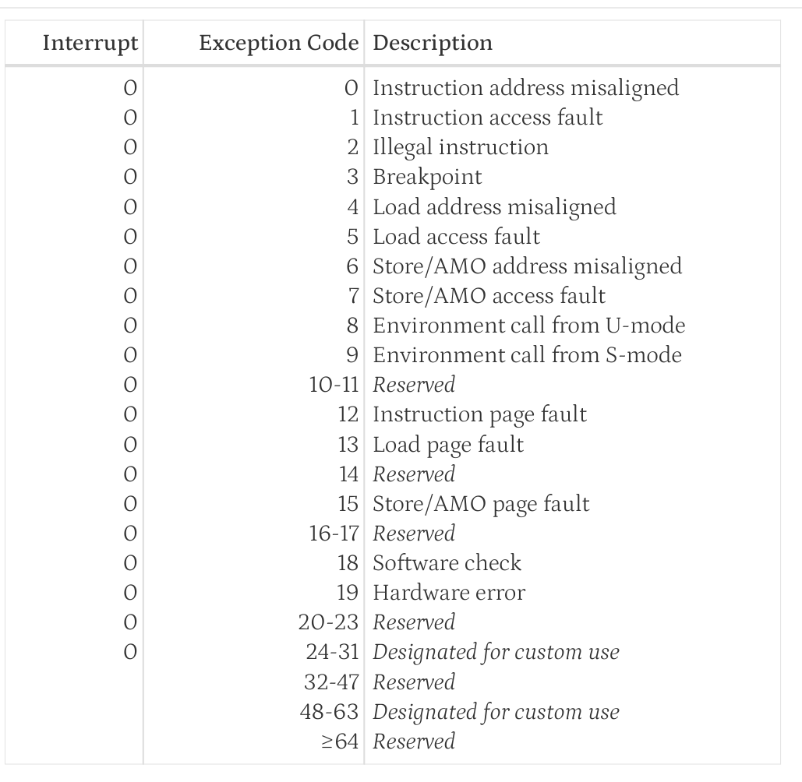

## medeleg && mideleg

By default, all traps at any privilege level are handled in machine mode, though a machine-mode
handler can redirect traps back to the appropriate level with the MRET instruction (Section 3.3.2). To
increase performance, implementations can provide individual read/write bits within medeleg and
mideleg to indicate that certain exceptions and interrupts should be processed directly by a lower
privilege level. The machine exception delegation register (medeleg) is a 64-bit read/write register. The
machine interrupt delegation register (mideleg) is an MXLEN-bit read/write register.  
**medeleg** has a bit position allocated for every synchronous exception shown in Table 14, **with the index
of the bit position equal to the value returned in the mcause register (i.e., setting bit 8 allows user-mode
environment calls to be delegated to a lower-privilege trap handler).**
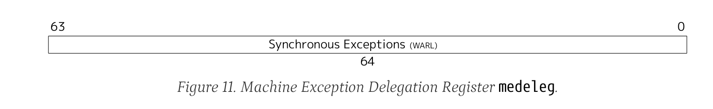
mideleg holds trap delegation bits for individual interrupts, **with the layout of bits matching those in
the mip register** (i.e., STIP interrupt delegation control is located in bit 5)
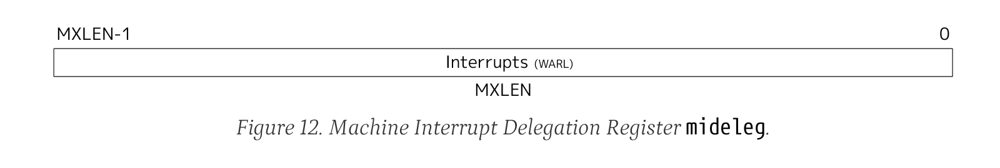
## stvec
The stvec register is an SXLEN-bit read/write register that holds trap vector configuration, consisting
of a vector base address (BASE) and a vector mode (MODE).
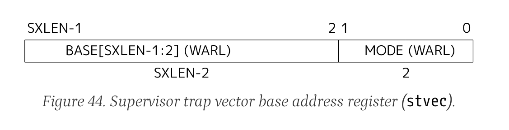
The BASE field in stvec is a field that can hold **any valid virtual or physical address, subject to the
following alignment constraints: the address must be 4-byte aligned**
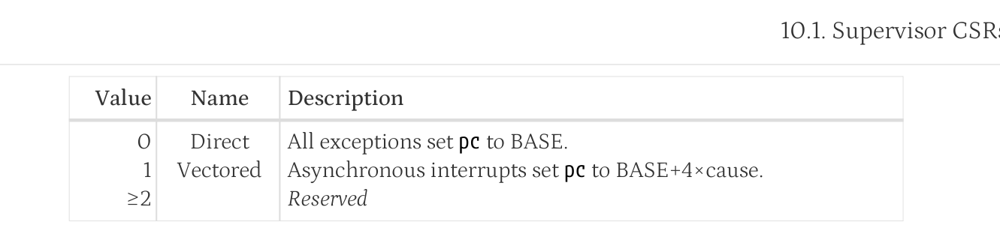  
e.g.  
When MODE=Direct, all traps into supervisor
mode cause the pc to be set to the address in the BASE field

## mtvec
like stvec
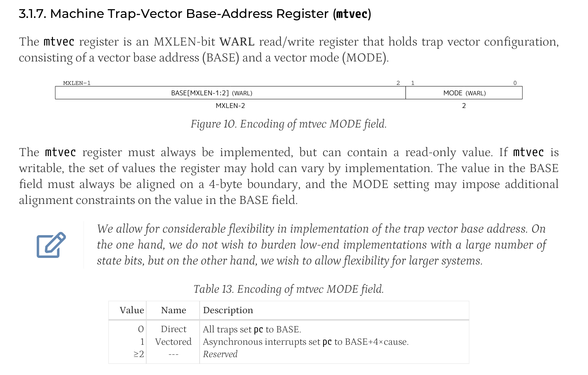

## pmpconfig
TODO: ?

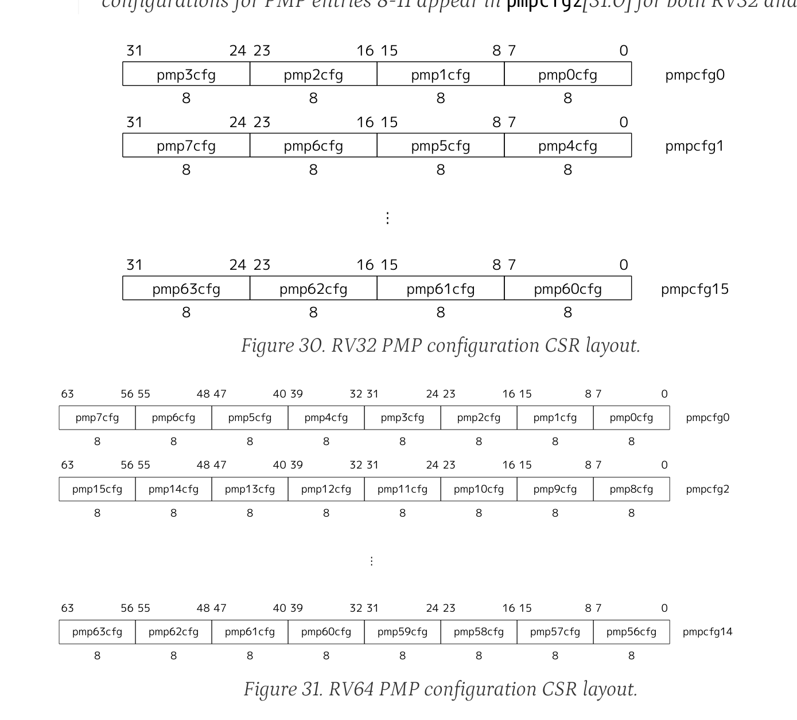

## satp

This register holds the physical **page number (PPN)** of the root page table, i.e., its supervisor physical
address divided by 4 KiB; an **address space identifier (ASID)**, which facilitates address-translation
fences on a per-address-space basis; and the **MODE field**, which selects the current address-
translation scheme. 
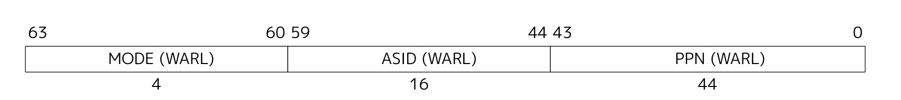

### mode field
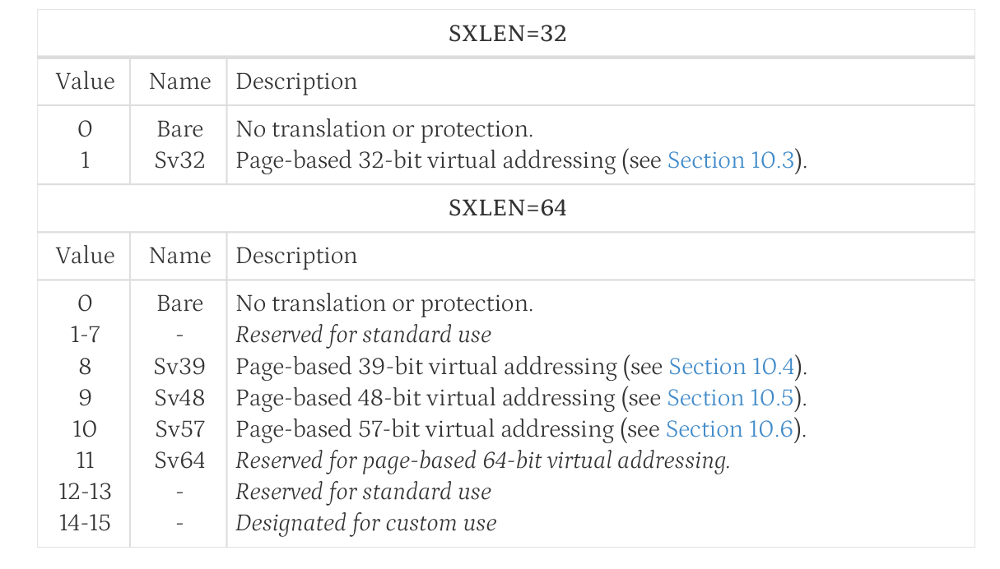

### sv-39
The 27-bit VPN is translated into a 44-bit PPN via a three-level page table, while the 12-bit page offset
is untranslated.
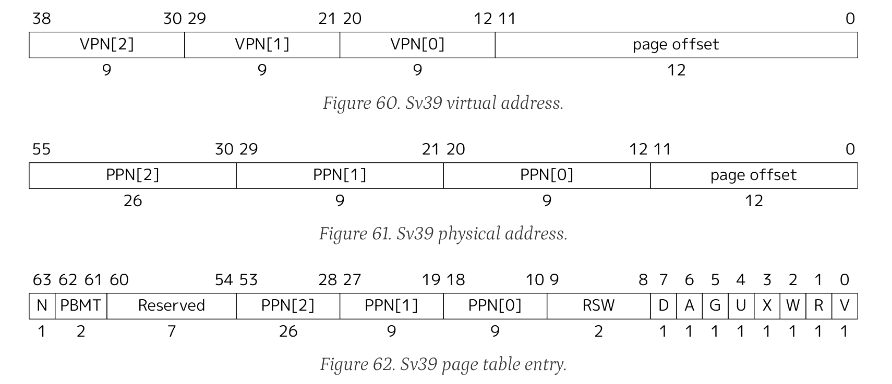

## mscratch
it is used to hold a pointer to a machine-mode hart-local context space and swapped with a
user register upon entry to an M-mode trap handler.
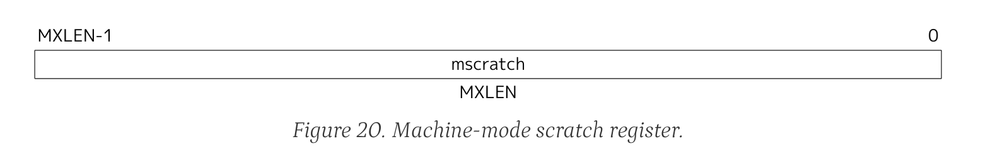

## stval
When a trap
is taken into S-mode, stval is written with exception-specific information to assist software in
handling the trap  
stval will **contain the faulting
virtual address when a breakpoint, address-misaligned, access-fault, or page-
fault exception occurs**.
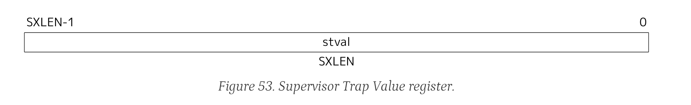

## mcounteren
TODO: ?  
The counter-enable register **mcounteren is a 32-bit register that controls the availability of the
hardware performance-monitoring counters to the next-lower privileged mode**.

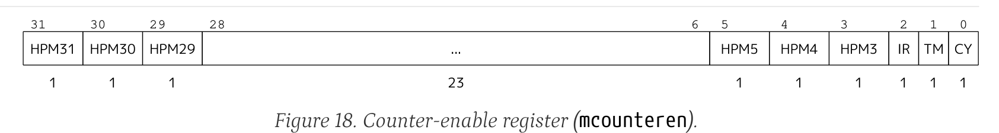

## mtime && mtimecmp
.A machine timer interrupt
becomes pending whenever mtime contains a value greater than or equal to mtimecmp, treating the
values as unsigned integers. The interrupt remains posted until mtimecmp becomes greater than mtime
(typically as a result of writing mtimecmp). The interrupt will only be taken if interrupts are enabled
and the MTIE bit is set in the mie register

## mhartid
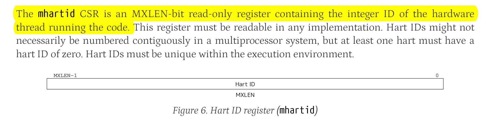

## tp

thread pointer, x4?

# 指令

## csrrw
The CSRRW (Atomic Read/Write CSR) instruction atomically swaps values in the CSRs and integer
registers. CSRRW reads the old value of the CSR, zero-extends the value to XLEN bits, then writes it to
integer register rd

## csrw
control and status register write

## ecall 
really important

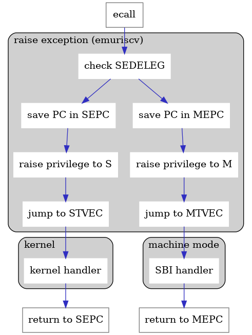

## sret

xRET sets the pc to the value stored in the xepc register

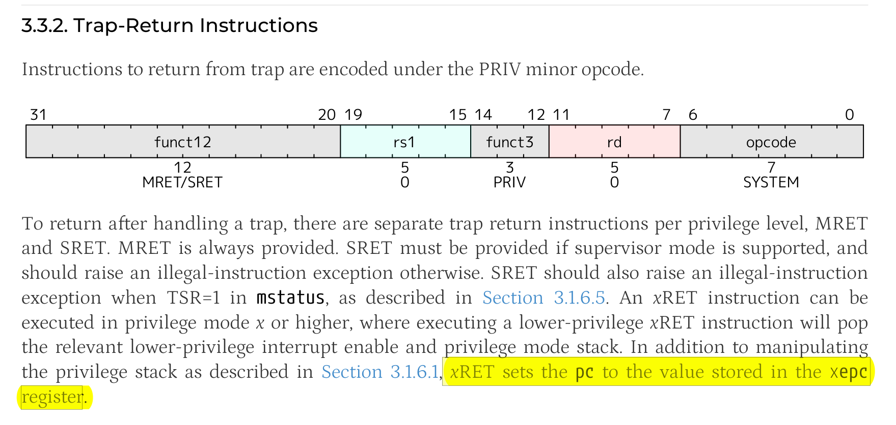

# 其他
WARL: write any, read legal  
WLRL: write legal, read legal  
WIRI: write ignore, read ignore  
WPRI: write preserved, read ignore  