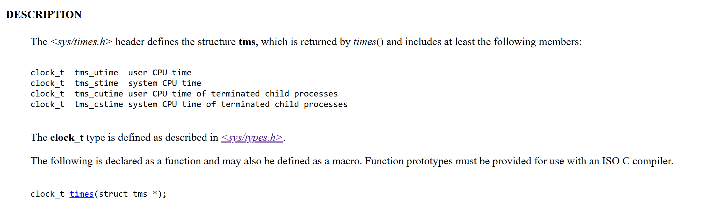
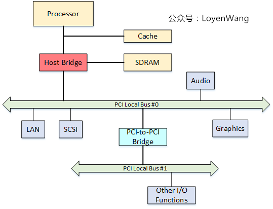
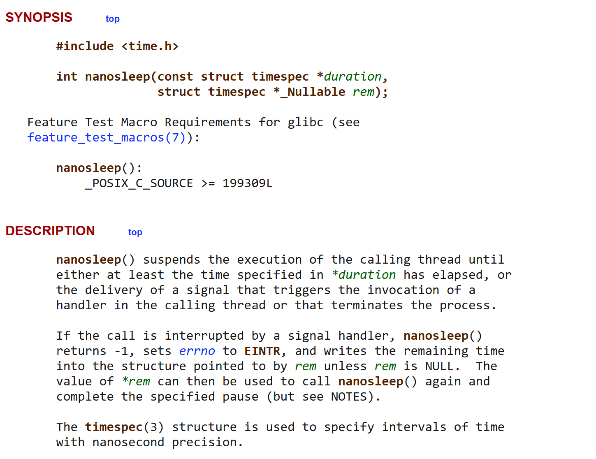
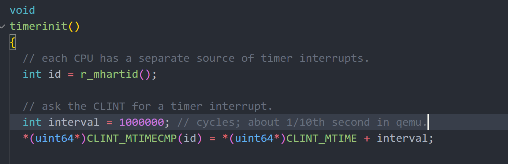
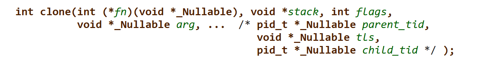
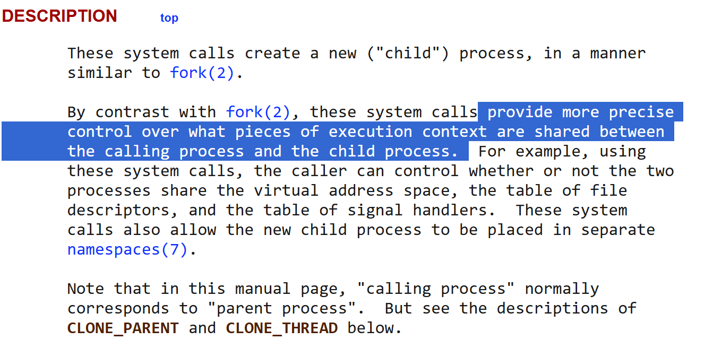
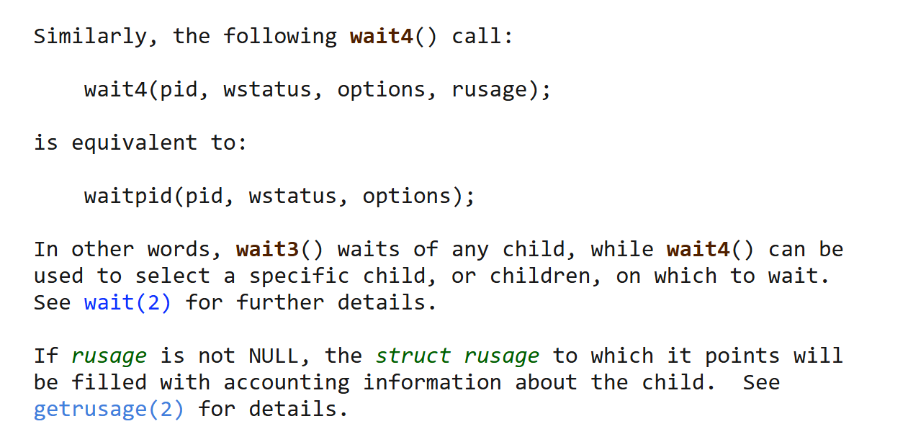
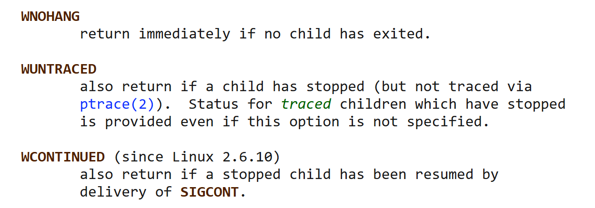

# rexvapor

该系统的实现一部分参考了Linux，部分参考了往届优秀作品Lostwakeup和10183boot,特此感谢。
## sys_times

https://www.man7.org/linux/man-pages/man0/sys_times.h.0p.html  

https://pubs.opengroup.org/onlinepubs/7908799/xsh/systimes.h.html  

### struct tms:  


1. add ktime and utime in *struct proc*
2. initializes fields while *initializing* the proc, clears when *freeproc* 
3. increase when timer interuppt trigger,in **kerneltrap** and **usertrap** resperctively

## sys_gettimeofday

### struct timespec:



## sys_nano_sleep

### discription:
https://man7.org/linux/man-pages/man2/nanosleep.2.html  


### TICKS_PER_SECOND:


*TICKS_PER_SECON (timer interrupt's times per second)* == 10 when interval is set to be 1000000  

cpu0 handle the clockintr() every time the time interrupt raises(falls in trap):  
```
void
clockintr()
{
  acquire(&tickslock);
  ticks++;
  wakeup(&ticks);
  release(&tickslock);
}
```
so can sleep in ``chan == traget_ticks``

如果要将xv6原有的`` sleep -- wakeup `` 方式改为使用 `` 条件变量 -- 等待队列``的方式，那么该如何实现精确计时呢？

在thread中增加一个timeout?

-- 暂时遍历整个等待队列？。。。好像不是很优雅

## sys_clone



## sys_wait4, sys_clone, sys_exit

closely related  

### sys_wait4


来看看具体解释：
  wait() and waitpid()
       The wait() system call suspends execution of the calling thread
       until one of its children terminates.  The call wait(&wstatus) is
       equivalent to:

           waitpid(-1, &wstatus, 0);

       The waitpid() system call suspends execution of the calling thread
       until a child specified by pid argument has changed state.  By
       default, waitpid() waits only for terminated children, but this
       behavior is modifiable via the options argument, as described
       below.

       The value of pid can be:

       < -1   meaning wait for any child process whose process group ID
              is equal to the absolute value of pid.

       -1     meaning wait for any child process.

       0      meaning wait for any child process whose process group ID
              is equal to that of the calling process at the time of the
              call to waitpid().

       > 0    meaning wait for the child whose process ID is equal to the
              value of pid.
                The value of options is an OR of zero or more of the following
       constants:

       WNOHANG
              return immediately if no child has exited.

       WUNTRACED
              also return if a child has stopped (but not traced via
              ptrace(2)).  Status for traced children which have stopped
              is provided even if this option is not specified.

       WCONTINUED (since Linux 2.6.10)
              also return if a stopped child has been resumed by delivery
              of SIGCONT.

       (For Linux-only options, see below.)

       If wstatus is not NULL, wait() and waitpid() store status
       information in the int to which it points.  This integer can be
       inspected with the following macros (which take the integer itself
       as an argument, not a pointer to it, as is done in wait() and
       waitpid()!):

       WIFEXITED(wstatus)
              returns true if the child terminated normally, that is, by
              calling exit(3) or _exit(2), or by returning from main().

       WEXITSTATUS(wstatus)
              returns the exit status of the child.  This consists of the
              least significant 8 bits of the status argument that the
              child specified in a call to exit(3) or _exit(2) or as the
              argument for a return statement in main().  This macro
              should be employed only if WIFEXITED returned true.

       WIFSIGNALED(wstatus)
              returns true if the child process was terminated by a
              signal.

       WTERMSIG(wstatus)
              returns the number of the signal that caused the child
              process to terminate.  This macro should be employed only
              if WIFSIGNALED returned true.

       WCOREDUMP(wstatus)
              returns true if the child produced a core dump (see
              core(5)).  This macro should be employed only if
              WIFSIGNALED returned true.

              This macro is not specified in POSIX.1-2001 and is not
              available on some UNIX implementations (e.g., AIX, SunOS).
              Therefore, enclose its use inside #ifdef WCOREDUMP ...
              #endif.

       WIFSTOPPED(wstatus)
              returns true if the child process was stopped by delivery
              of a signal; this is possible only if the call was done
              using WUNTRACED or when the child is being traced (see
              ptrace(2)).

       WSTOPSIG(wstatus)
              returns the number of the signal which caused the child to
              stop.  This macro should be employed only if WIFSTOPPED
              returned true.

       WIFCONTINUED(wstatus)
              (since Linux 2.6.10) returns true if the child process was
              resumed by delivery of SIGCONT.
don't need rusage  
* flags:  



## sys_exec

# 系统调用的说明以及调用方式

系统调用方式遵循 RISC-V ABI，即调用号存放在 a7 寄存器中，6 个参数分别储存在 a0-a5 寄存器中，返回值保存在 a0 中。

主要参考了 Linux 5.10 syscalls，详细请参见：[man7 系统调用文档](https://man7.org/linux/man-pages/man2/syscalls.2.html)

## 文件系统相关
- [ ] SYS_getcwd  
- [ ] SYS_pipe2  
- [ ] SYS_dup  
- [ ] SYS_dup3  
- [ ] SYS_chdir  
- [ ] SYS_openat  
- [ ] SYS_close  
- [ ] SYS_getdents64  
- [ ] SYS_read  
- [ ] SYS_write  
- [ ] SYS_linkat  
- [ ] SYS_unlinkat  
- [ ] SYS_mkdirat  
- [ ] SYS_umount2  
- [ ] SYS_mount  
- [ ] SYS_fstat  

## 进程管理相关
- [x] SYS_clone  
- [ ] SYS_execve  
- [x] SYS_wait4  
- [x] SYS_exit  
- [x] SYS_getppid  
- [x] SYS_getpid  

## 内存管理相关
- [ ] SYS_brk  
- [ ] SYS_munmap  
- [ ] SYS_mmap  

## 其他
- [x] SYS_times  
- [x] SYS_uname  
- [x] SYS_sched_yield    /// need to implement ``clone`` and ``wait`` first
- [x] SYS_gettimeofday
- [x] SYS_nanosleep  
