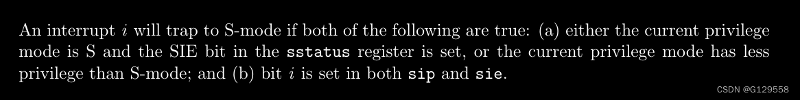
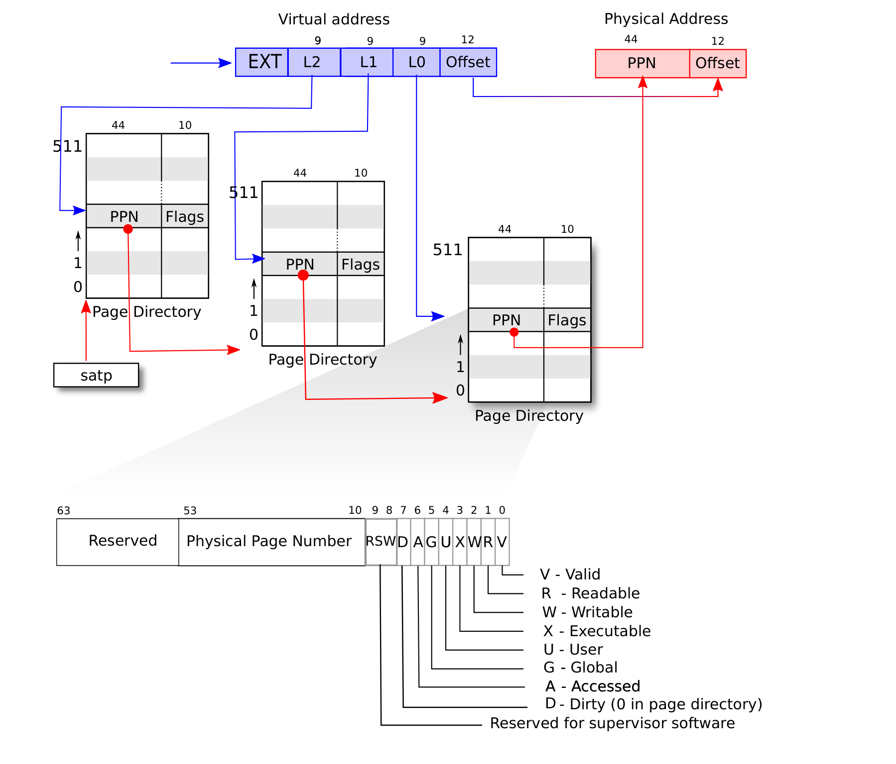

# 系统启动
entry.s -> start() -> main()

-- start()中已初始化时钟中断
## 

##  timer interrupt :

references:  https://blog.csdn.net/G129558/article/details/132571881

set sip = 2, pending a software interrupt.
 

timerinit() : 
1. set reg_mtvec = timervec
2. timervec set sip
3. enable machine-mode interrupt

the in main has call trapinithart():
```
void
trapinithart(void)
{
  w_stvec((uint64)kernelvec);
}
```

trap goes to kernelvec(kernel.s) -> kerneltrap() -> devintr() to recognize the software interrupt (and other types of interrupts)

## scheduler: 

references:  
1. https://blog.csdn.net/zzy980511/article/details/131519246?spm=1001.2014.3001.5502  
2. https://blog.csdn.net/zzy980511/article/details/137831750

## trap


### kerneltrap
```
1. trapinithart() do w_stvec(kernelvec)
2. kernelvec() calls kerneltrap()
3. w_sepc() at last (return address)
4. exception return 
```
###  usertrap
```
1. fork() will set the process's context -> ra = forkret
2. forkret() call usertrapret()
3. usertrapret() do w_stvec(trampoline_uservec);
4. usertrapret() call userret() in trampoline.S
5. userret() change the pgtable, sret

6. next time, the usertrap will go to trampoline_uservec, which call usertrap() at last.
7. usertrap() call usertrapret()
```

### trampoline

contain the ``uservec()`` and ``userret()``

 ps:
 1. trampoline should be mapped in every process' page table at the address TRAMPOLINE 

 ### trapframe

each process has a separate p->trapframe memory area,
but it's mapped to the **same virtual address
(TRAPFRAME)** in every process's user page table.


 save **all the user registers** and 

 ```
   /*   0 */ uint64 kernel_satp;   // kernel page table
  /*   8 */ uint64 kernel_sp;     // top of process's kernel stack
  /*  16 */ uint64 kernel_trap;   // usertrap()
  /*  24 */ uint64 epc;           // saved user  program counter
  /*  32 */ uint64 kernel_hartid; // saved kernel tp

  ```


save and restore when `uservec()` and `userret()`

### kernel page table

processes shared the same pagetable, with different vitural memmory 

```
// Allocate a page for each process's kernel stack.
// Map it high in memory, followed by an invalid
// guard page.
void
thread_mapstacks(pagetable_t kpgtbl)
{
  struct proc *p;
  
  for(p = proc; p < &proc[NPROC]; p++) {
    char *pa = kalloc();
    if(pa == 0)
      panic("kalloc");
    uint64 va = KSTACK((int) (p - proc));
    kvmmap(kpgtbl, va, (uint64)pa, PGSIZE, PTE_R | PTE_W);
  }
}
```

### exec()

Exec(), on the other hand, replaces the process's program with a new program. It's still the same process, but with new code (and variables, stack, etc.). Registers, pid, etc. remain the same.


### pgtbl

